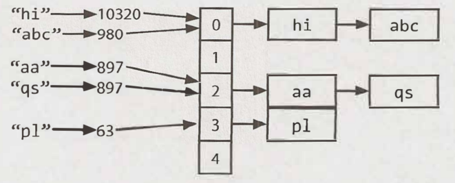
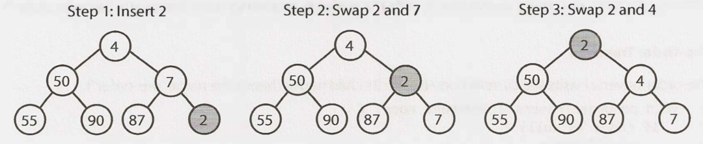
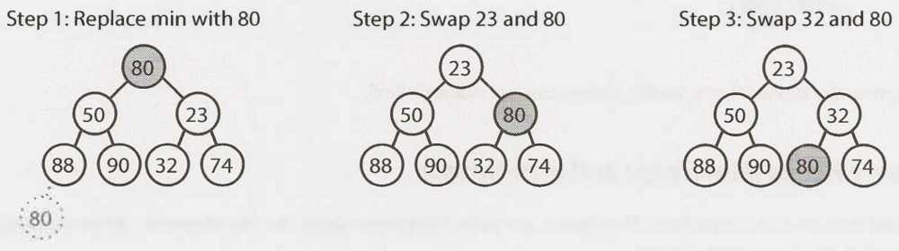
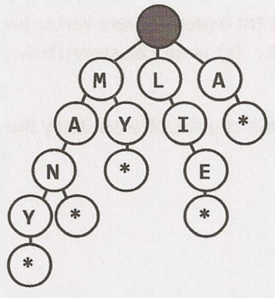
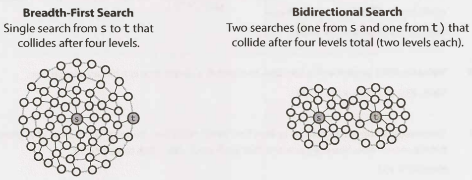
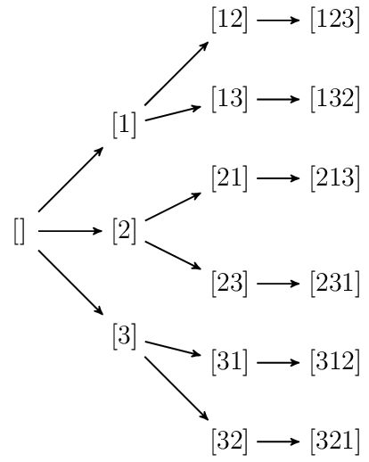
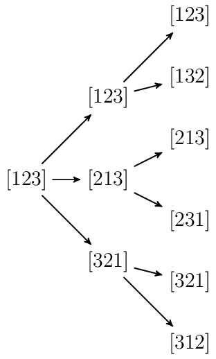
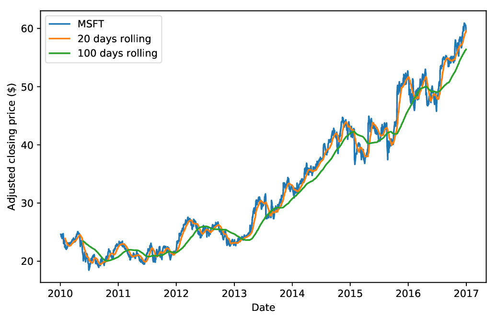

[![Github][jump_to_github]](https://github.com/MartingaleField/MartingaleField.github.io/blob/master/README.md)
[![Webpage][jump_to_webpage]](https://martingalefield.github.io/)
    


# Table of Contents
- [Table of Contents](#table-of-contents)
- [Data Structures](#data-structures)
  - [Hash Tables](#hash-tables)
    - [Degree of an Array](#degree-of-an-array)
    - [Substring with Concatenation of All Words](#substring-with-concatenation-of-all-words)
  - [Arrays](#arrays)
    - [Two Sum](#two-sum)
    - [Container With Most Water](#container-with-most-water)
    - [Trapping Rain Water](#trapping-rain-water)
    - [3Sum](#3sum)
    - [3Sum Closest](#3sum-closest)
    - [4Sum](#4sum)
    - [4Sum II](#4sum-ii)
    - [Remove Duplicates from Sorted Array](#remove-duplicates-from-sorted-array)
    - [Remove Duplicates from Sorted Array II](#remove-duplicates-from-sorted-array-ii)
    - [Find Missing Positive](#find-missing-positive)
    - [Insert Interval](#insert-interval)
    - [Interval List Intersections](#interval-list-intersections)
    - [Majority Element](#majority-element)
    - [Majority Element II](#majority-element-ii)
    - [Minimum Size Subarray Sum](#minimum-size-subarray-sum)
    - [Product of Array Except Self](#product-of-array-except-self)
    - [Missing Number](#missing-number)
    - [Contains Duplicate III](#contains-duplicate-iii)
    - [H-Index](#h-index)
  - [Strings](#strings)
    - [Rabin-Karp Substring Search](#rabin-karp-substring-search)
  - [Stacks and Queues](#stacks-and-queues)
  - [Binary Tree](#binary-tree)
    - [Binary Tree Inorder Traversal](#binary-tree-inorder-traversal)
    - [Binary Tree Preorder Traversal](#binary-tree-preorder-traversal)
    - [Binary Tree Postorder Traversal](#binary-tree-postorder-traversal)
    - [Binary Tree Level Order Traversal](#binary-tree-level-order-traversal)
    - [Binary Tree Zigzag Level Order Traversal](#binary-tree-zigzag-level-order-traversal)
    - [Same Tree](#same-tree)
    - [Construct Binary Tree from Preorder and Inorder Traversal](#construct-binary-tree-from-preorder-and-inorder-traversal)
    - [Construct Binary Tree from Inorder and Postorder Traversal](#construct-binary-tree-from-inorder-and-postorder-traversal)
  - [Binary Heaps (Min-Heaps and Max-Heaps)](#binary-heaps-min-heaps-and-max-heaps)
    - [Kth Largest Element in a Stream](#kth-largest-element-in-a-stream)
  - [Binary Search Tree](#binary-search-tree)
    - [Kth Smallest Element in a BST](#kth-smallest-element-in-a-bst)
    - [Validate Binary Search Tree](#validate-binary-search-tree)
    - [Recover Binary Search Tree](#recover-binary-search-tree)
    - [Minimum Distance Between BST Nodes](#minimum-distance-between-bst-nodes)
  - [Tries (Prefix Trees)](#tries-prefix-trees)
  - [Graphs](#graphs)
    - [Generate Parentheses](#generate-parentheses)
    - [Sudoku Solver](#sudoku-solver)
    - [Combination Sum](#combination-sum)
    - [Combination Sum II](#combination-sum-ii)
    - [Combination Sum III](#combination-sum-iii)
    - [Permutations](#permutations)
    - [Permutations II](#permutations-ii)
    - [N-Queens](#n-queens)
    - [N-Queens II](#n-queens-ii)
    - [Combinations](#combinations)
    - [Subsets](#subsets)
    - [Subsets II](#subsets-ii)
- [Algorithms](#algorithms)
  - [Sorting](#sorting)
    - [Pancake Sorting](#pancake-sorting)
  - [Divide and Conquer](#divide-and-conquer)
    - [Median of Two Sorted Arrays](#median-of-two-sorted-arrays)
    - [Kth Largest Element in an Array](#kth-largest-element-in-an-array)
  - [Binary Search](#binary-search)
    - [Basics](#basics)
    - [H-Index II](#h-index-ii)
  - [Dynamic Programming](#dynamic-programming)
    - [Best Time to Buy and Sell Stock IV](#best-time-to-buy-and-sell-stock-iv)
- [Design](#design)
    - [LRU Cache](#lru-cache)
- [Pandas](#pandas)
  - [Time Series Data Manipulation](#time-series-data-manipulation)
    - [Reindexing and NA-Filling](#reindexing-and-na-filling)
    - [Moving average](#moving-average)
    - [Returns](#returns)


# Data Structures

## Hash Tables

One simple but common implementation:
1. Compute the key's hash code (usually an `int` or `long`). Note that two different keys could have the same hash code (there may be infinite number of keys and a finite number of ints).
2. Map the hash code to an index in the array. E.g. `hash(key) % array_length`. Two different hash codes could, of course, map to the same index.
3. At each index, there is a linked list of keys and values. Store the key and value in this index. 



To retrieve: key -> hash code -> index -> search in linked list. 

If the number of collisions is high, the worst case runtime is `O(N)`, where `N` is the number of keys. 
We generally assume a good implementation that keeps collisions to a minimum, in which case the lookup time is `O(1)`.

Alternatively, we can implement the hash table with a balanced BST. This gives us an `O(log N)` lookup time. The advantage is potentially less space, since we no longer allocate a large array. We can also iterate through the keys in order (e.g. through an [*inorder traversal of BST*](#binary-tree-inorder-traversal)), which can be useful sometimes.

* Example: [Kth Smallest Element in a BST](#kth-smallest-element-in-a-bst)

[![Back to Front][badge_back_to_front]](#table-of-contents)

### [Degree of an Array](https://leetcode.com/problems/degree-of-an-array/)

Given a non-empty array of non-negative integers `nums`, the **degree** of this array is defined as the maximum frequency of any one of its elements.

Your task is to find the smallest possible length of a (contiguous) subarray of `nums`, that has the same degree as `nums`.

```
Input: [1, 2, 2, 3, 1]
Output: 2
Explanation: 
The input array has a degree of 2 because both elements 1 and 2 appear twice.
Of the subarrays that have the same degree:
[1, 2, 2, 3, 1], [1, 2, 2, 3], [2, 2, 3, 1], [1, 2, 2], [2, 2, 3], [2, 2]
The shortest length is 2. So return 2.
```

#### Solution
The degree is determined by the element with maximum frequency. Therefore the required subarray must include every one of this element. The shortest will start from the first occurrence of this element and end with the last occurrence.

![Python3][python3]
```python
def findShortestSubArray(self, nums: List[int]) -> int:
    cnt = Counter(nums)
    degree = max(cnt.values())

    left_right = {}
    for i, num in enumerate(nums):
        if num not in left_right:
            left_right[num] = [i, i]
        else:
            left_right[num][1] = i

    ans = len(nums)
    for x, c in cnt.items():
        if c == degree:
            ans = min(ans, left_right[x][1] - left_right[x][0] + 1)
    return ans
```

### [Substring with Concatenation of All Words](https://leetcode.com/problems/substring-with-concatenation-of-all-words/)

You are given a string, `s`, and a list of words, `words`, that are all of the same length. Find all starting indices of substring(s) in `s` that is a concatenation of each word in `words` exactly once and without any intervening characters.

#### Solution

![Python3][python3]
```python
from collections import defaultdict, Counter

class Solution:
    def findSubstring(self, s: str, words: List[str]) -> List[int]:
        if not words or not s:
            return []

        len_str, n_words, len_word = len(s), len(words), len(words[0])

        ans = []
        cnt = Counter(words)
        for i in range(len_str - n_words * len_word + 1):
            seen = defaultdict(int)
            for j in range(n_words):
                word = s[(i + j * len_word): (i + (j + 1) * len_word)]
                if word in cnt:
                    seen[word] += 1
                    # if word is seen more than its occurrence in words
                    if seen[word] > cnt[word]:  
                        break
                else:
                    break
            if seen[word] <= cnt[word] and word in cnt:
                ans.append(i)
        return ans
```

## Arrays

*Why is the amortized insertion runtime `O(1)`?*

For an resizable array of size `N`, how many elements are copied at each capacity increase?

- Final capacity increase: `n/2` elements to copy
- Previous capacity increase: `n/4` elements to copy
- Previous capacity increase: `n/8` elements to copy
- ...
- Second capacity increase: `2` elements to copy
- First capacity increase: `1` element to copy
  
In total, the number of copies to insert `N` elements is roughly `N/2 + N/4 + N/8 + ... + 2 + 1`, which is just less than `N`. Therefore, inserting `N` elements takes `O(N)` work total. Each insertion is `O(1)` on average, even though some insertions take `O(N)` time in the worst case.

[![Back to Front][badge_back_to_front]](#table-of-contents)

### [Two Sum](https://leetcode.com/problems/two-sum/)

Given an array of integers, return **indices** of the two numbers such that they add up to a specific target.
You may assume that each input would have **exactly one** solution, and you may not use the same element twice.

#### Solution 

![C++][c++]
```c++
vector<int> twoSum(vector<int> &nums, int target) {
    vector<int> ans;
    if (nums.empty()) return ans;

    unordered_map<int, int> num_to_idx;
    for (int i = 0; i < nums.size(); ++i) {
        int gap = target - nums[i];
        if (num_to_idx.find(gap) != num_to_idx.end()) {
            ans.emplace_back(i);
            ans.emplace_back(num_to_idx[gap]);
            break;
        }
        num_to_idx.emplace(nums[i], i);
    }
    return ans;
}
```

![Python3][python3]
```python
def twoSum(nums: List[int], target: int) -> List[int]:
    num_to_idx = {}
    for i, num in enumerate(nums):
        gap = target - num
        if gap not in num_to_idx:
            num_to_idx[num] = i
        else:
            return i, num_to_idx[gap]
```
[![Back to Front][badge_back_to_front]](#table-of-contents)

---

### [Container With Most Water](https://leetcode.com/problems/container-with-most-water/)

Given `n` non-negative integers `a1, a2, ..., an` , where each represents a point at coordinate `(i, ai)`. `n` vertical lines are drawn such that the two endpoints of line `i` is at `(i, ai)` and `(i, 0)`. Find two lines, which together with x-axis forms a container, such that the container contains the most water.


#### Solution: Two Pointers

Pointer `i` points to the first element and `j` to the last. The water volume is `(j - i) * h` where `h = min(height[i], height[j])`.
* If there exists taller bar on the right of `i` than `h`, move `i` to it and check if we have a better result.
* If there exists taller bar on the left of `j` than `h`, move `j` to it and check if we have a better result.

![C++][c++]
```c++
int maxArea(vector<int> &height) {
    int water = 0;
    int i = 0, j = height.size() - 1;
    while (i < j) {
        int h = min(height[i], height[j]);
        water = max(water, (j - i) * h);
        while (height[i] <= h && i < j) i++;
        while (height[j] <= h && i < j) j--;
    }
    return water;
}
```

![Python3][python3]
```python
def maxArea(self, height: List[int]) -> int:
    i, j = 0, len(height) - 1
    ans = 0
    while i < j:
        h = min(height[i], height[j])
        ans = max(ans, (j - i) * h)
        while height[i] <= h and i < j:
            i += 1
        while height[j] <= h and i < j:
            j -= 1
    return ans
```
[![Back to Front][badge_back_to_front]](#table-of-contents)

---


### [Trapping Rain Water](https://leetcode.com/problems/trapping-rain-water/)

Given n non-negative integers representing an elevation map where the width of each bar is 1, compute how much water it is able to trap after raining.


#### Solution: DP

![Python3][python3]
```python
def trap(self, height: List[int]) -> int:
    n = len(height)
    if n == 0:
        return 0

    water = 0
    left_max = [0] * n
    right_max = [0] * n

    left_max[0] = height[0]
    for i in range(1, n):
        left_max[i] = max(height[i], left_max[i - 1])

    right_max[-1] = height[-1]
    for i in range(n - 2, -1, -1):
        right_max[i] = max(height[i], right_max[i + 1])

    for i in range(1, n - 1):
        water += min(left_max[i], right_max[i]) - height[i]

    return water
```

#### Solution: Two Pointers

NB: in the loop below, every time we find `height[l] < height[r]`, it is guranteed that `height[r] >= left_max`. Similarly, every time we find `height[l] >= height[r]`, we must have `height[l] >= right_max`.

![Python3][python3]
```python
def trap(self, height: List[int]) -> int:
    n = len(height)
    if n == 0:
        return 0

    water = 0
    left_max, right_max = 0, 0
    l, r = 0, n - 1
    while l < r:
        if height[l] < height[r]:  # right bar is taller so can focus on left pointer area
            water += max(left_max - height[l], 0)
            left_max = max(left_max, height[l])
            l += 1
        else:  # left bar is taller so can focus on right pointer area
            water += max(right_max - height[r], 0)
            right_max = max(right_max, height[r])
            r -= 1
    return water

```
[![Back to Front][badge_back_to_front]](#table-of-contents)

---


### [3Sum](https://leetcode.com/problems/3sum/)

Given an array nums of n integers, are there elements `a, b, c` in nums such that `a + b + c = 0`? Find all unique triplets in the array which gives the sum of zero.

The solution set must not contain duplicate triplets.

#### Solution 

![C++][c++]
```c++
vector<vector<int>> threeSum(vector<int> &nums) {
    vector<vector<int>> result;
    sort(nums.begin(), nums.end());
    int n = nums.size();
    for (int i = 0; i < n - 2; ++i) {
        if (i > 0 && nums[i] == nums[i - 1]) continue;
        int j = i + 1, k = n - 1;
        while (j < k) {
            int sum = nums[i] + nums[j] + nums[k];
            if (sum < 0) {
                ++j;
                while (j < k && nums[j] == nums[j - 1]) ++j;
            } else if (sum > 0) {
                --k;
                while (j < k && nums[k] == nums[k + 1]) --k;
            } else {
                result.push_back({nums[i], nums[j++], nums[k--]});
                while (j < k && nums[j] == nums[j - 1] && nums[k] == nums[k + 1])
                    ++j, --k;
            }
        }
    }
    return result;
}
```

![Python3][python3]
```python
def threeSum(nums: 'List[int]') -> 'List[List[int]]':
    ans = []
    nums.sort()
    n = len(nums)
    for i in range(n - 2):
        j, k = i + 1, n - 1
        if i > 0 and nums[i] == nums[i - 1]:
            continue
        while j < k:
            sum = nums[i] + nums[j] + nums[k]
            if sum < 0:
                j += 1
                # skip over duplicates
                while j < k and nums[j] == nums[j - 1]:
                    j += 1
            elif sum > 0:
                k -= 1
                # skip over duplicates
                while j < k and nums[k] == nums[k + 1]:
                    k -= 1
            else:
                ans.append([nums[i], nums[j], nums[k]])
                j += 1
                k -= 1
                # skip over duplicates
                while j < k and nums[j] == nums[j - 1] and nums[k] == nums[k + 1]:
                    j += 1
                    k -= 1
    return ans
```
[![Back to Front][badge_back_to_front]](#table-of-contents)

---

### [3Sum Closest](https://leetcode.com/problems/3sum-closest/)

Given an array nums of `n` integers and an integer target, find three integers in `nums` such that the sum is closest to `target`. Return the sum of the three integers. You may assume that each input would have exactly one solution.

#### Solution 

Note that in this problem we are guaranteed that there is only one solution. Therefore there is no need to handle duplicates like we do in [3Sum](#3sum).

![C++][c++]
```c++
int threeSumClosest(vector<int> &nums, int target) {
    int res = nums[0] + nums[1] + nums[2], n = nums.size();
    sort(nums.begin(), nums.end());
    for (int i = 0; i < n; ++i) {
        int j = i + 1, k = n - 1;
        while (j < k) {
            int diff = target - nums[i] - nums[j] - nums[k];
            if (diff == 0)
                return target;
            if (abs(diff) < abs(res - target)) {
                res = nums[i] + nums[j] + nums[k];
            } else if (diff < 0) {
                k--;
            } else {
                j++;
            }
        }
    }
    return res;
}
```

![Python3][python3]
```python
def threeSumClosest(nums: 'List[int]', target: 'int') -> 'int':
    nums.sort()
    ans = nums[0] + nums[1] + nums[2]
    n = len(nums)
    for i in range(n - 2):
        j, k = i + 1, n - 1
        while j < k:
            sum = nums[i] + nums[j] + nums[k]
            diff = target - sum
            if diff > 0:
                j += 1
            elif diff < 0:
                k -= 1
            else:
                ans = sum
                break
            if abs(diff) < abs(target - ans):
                ans = sum
    return ans
```
[![Back to Front][badge_back_to_front]](#table-of-contents)

---

### [4Sum](https://leetcode.com/problems/4sum/)

Given an array `nums` of `n` integers and an integer `target`, are there elements `a`, `b`, `c`, and `d` in `nums` such that `a + b + c + d = target`? Find all unique quadruplets in the array which gives the sum of `target`.

The solution set must not contain duplicate quadruplets.

#### Solution 
![C++][c++]
```c++
vector<vector<int>> fourSum(vector<int> &nums, int target) {
    vector<vector<int>> result;
    int n = nums.size();
    if (n < 4) return result;
    sort(nums.begin(), nums.end());
    for (int a = 0; a < n - 3; ++a) {
        // Pruning
        if (nums[a] + nums[n - 1] + nums[n - 2] + nums[n - 3] < target ||
            nums[a] + nums[a + 1] + nums[a + 2] + nums[a + 3] > target ||
            (a > 0 && nums[a] == nums[a - 1]))
            continue;
        for (int b = a + 1; b < n - 2; ++b) {
            if (b > a + 1 && nums[b] == nums[b - 1])
                continue;
            int c = b + 1, d = n - 1;
            while (c < d) {
                int sum = nums[a] + nums[b] + nums[c] + nums[d];
                if (sum < target) {
                    c++;
                    while (c < d && nums[c] == nums[c - 1])
                        c++;
                } else if (sum > target) {
                    d--;
                    while (c < d && nums[d] == nums[d + 1])
                        d--;
                } else {
                    result.push_back({nums[a], nums[b], nums[c++], nums[d--]});
                    while (c < d && nums[c] == nums[c - 1] && nums[d] == nums[d + 1])
                        c++, d--;
                }
            }
        }
    }
    return result;
}
```
[![Back to Front][badge_back_to_front]](#table-of-contents)

---


### [4Sum II](https://leetcode.com/problems/4sum-ii/)

Given four lists `A, B, C, D` of integer values, compute how many tuples `(i, j, k, l)` there are such that `A[i] + B[j] + C[k] + D[l]` is zero.

To make problem a bit easier, all `A, B, C, D` have same length of `N` where `0 <= N <= 500`.

#### Solution 
![C++][c++]
```c++
int fourSumCount(vector<int> &A, vector<int> &B, vector<int> &C, vector<int> &D) {
    unordered_map<int, int> sum_freq;
    int ans = 0;
    for (int a : A)
        for (int b : B)
            sum_freq[a + b]++;
    for (int c : C)
        for (int d : D)
            if (sum_freq.count(-(c + d)))
                ans += sum_freq[-(c + d)];
    return ans;
}
```
[![Back to Front][badge_back_to_front]](#table-of-contents)

---


### [Remove Duplicates from Sorted Array](https://leetcode.com/problems/remove-duplicates-from-sorted-array/)

Given a sorted array `nums`, remove the duplicates in-place such that each element appear only once and return the new length.

Do not allocate extra space for another array, you must do this by **modifying the input array in-place** with `O(1)` extra memory.

#### Solution 
![C++][c++]
```c++
int removeDuplicates(vector<int> &nums) {
    if (nums.size() < 2)
        return nums.size();
    int j = 1;
    for (int i = 1; i < nums.size(); ++i) {
        if (nums[i] != nums[j - 1]) {
            nums[j++] = nums[i];
        }
    }
    return j;
}
```
[![Back to Front][badge_back_to_front]](#table-of-contents)

---


### [Remove Duplicates from Sorted Array II](https://leetcode.com/problems/remove-duplicates-from-sorted-array-ii/)

Given a sorted array `nums`, remove the duplicates **in-place** such that duplicates appeared at most **twice** and return the new length.

Do not allocate extra space for another array, you must do this by modifying the input array in-place with O(1) extra memory.

#### Solution
At first glance, we can follow the same idea as previous problem. Compare `nums[i]` with the current last two elements of the new array. If either of the comparison return false, we can update the new array. 

In fact, we simply need to compare `nums[i] == nums[j - 2]`. If this returns false, we can update the new array no matter what.
- If `nums[i] == nums[j - 1]`, since we allow at most two duplicates, we can copy `nums[i]` to the end of the new array.

![C++][c++]
```c++
int removeDuplicates(vector<int> &nums) {
    if (nums.size() < 3)
        return nums.size();
    int j = 2;
    for (int i = 2; i < nums.size(); ++i) {
        if (nums[i] != nums[j - 2]) {
            nums[j++] = nums[i];
        }
    }
    return j;
}
```
[![Back to Front][badge_back_to_front]](#table-of-contents)

---


### [Find Missing Positive](https://leetcode.com/problems/first-missing-positive/)

Given an unsorted integer array, find the smallest missing positive integer.

Your algorithm should run in O(n) time and uses constant extra space.

Example
```
Input: [3,4,-1,1]
Output: 2
```

#### Solution
- Scan through `nums` and swap each positive number `A[i]` with `A[A[i]-1]`. If `A[A[i]-1]` is again positive, swap it with `A[A[A[i]-1]-1]`... Do this iteratively until we meet a negative number or we have done put all the positive numbers at their correct locations. E.g. `[3, 4, -1, 1]` will become `[1, -1, 3, 4]`.
- Iterate integers `1` to `n + 1` and check one by one if `i` is located at `i - 1` already. If not, then `i` is the first missing positive integer. 


![Python3][python3]
```python
def firstMissingPositive(nums: 'List[int]') -> 'int':
    for i in range(len(nums)):
        while nums[i] > 0 and nums[i] <= len(nums) and nums[i] != nums[nums[i] - 1]:
            correct_idx = nums[i] - 1
            nums[i], nums[correct_idx] = nums[correct_idx], nums[i]

    for i in range(1, len(nums) + 1):
        if nums[i - 1] != i:
            return i
    return len(nums) + 1
```
[![Back to Front][badge_back_to_front]](#table-of-contents)

---


### [Insert Interval](https://leetcode.com/problems/insert-interval/)

Given a set of non-overlapping intervals, insert a new interval into the intervals (merge if necessary).

You may assume that the intervals were initially sorted according to their start times.

Example
```
Input: intervals = [[1,3],[6,9]], newInterval = [2,5]
Output: [[1,5],[6,9]]
```

#### Solution 
![C++][c++]
```c++
vector<Interval> insert(vector<Interval> &intervals, Interval newInterval) {
    vector<Interval> result;
    for (auto it = intervals.begin(); it != intervals.end(); it++) {
        if (it->end < newInterval.start) {
            result.emplace_back(*it);
        } else if (it->start > newInterval.end) {
            result.emplace_back(newInterval);
            copy(it, intervals.end(), back_inserter(result));
            return result;
        } else {
            newInterval.start = min(newInterval.start, it->start);
            newInterval.end = max(newInterval.end, it->end);
        }
    }
    result.push_back(newInterval);
    return result;
}
```

![Python3][python3]
```python
def insert(intervals: 'List[Interval]', newInterval: 'Interval') -> 'List[Interval]':
    s, e = newInterval.start, newInterval.end
    left_part = [_ for _ in intervals if _.end < s]
    right_part = [_ for _ in intervals if _.start > e]
    if left_part + right_part != intervals:
        s = min(s, intervals[len(left_part)].start)
        # a[~i] = a[len(a)-i-1], the i-th element from right to left
        e = max(e, intervals[~len(right_part)].end)  
    return left_part + [Interval(s, e)] + right_part
```
[![Back to Front][badge_back_to_front]](#table-of-contents)

---


### [Interval List Intersections](https://leetcode.com/problems/interval-list-intersections/)
Given two lists of closed intervals, each list of intervals is pairwise disjoint and in sorted order.

Return the intersection of these two interval lists.

(Formally, a closed interval `[a, b]` (with `a <= b`) denotes the set of real numbers `x` with `a <= x <= b`.  The intersection of two closed intervals is a set of real numbers that is either empty, or can be represented as a closed interval.  For example, the intersection of `[1, 3]` and `[2, 4]` is `[2, 3]`.)


![Python3][python3]
```python
def intervalIntersection(self, A: List[List[int]], B: List[List[int]]) -> List[List[int]]:
    ans = []
    i, j = 0, 0
    while i < len(A) and j < len(B):
        lo = max(A[i][0], B[j][0])
        hi = min(A[i][1], B[j][1])
        if lo <= hi:
            ans.append([lo, hi])

        if A[i][1] < B[j][1]:
            i += 1
        else:
            j += 1
    return ans
```
[![Back to Front][badge_back_to_front]](#table-of-contents)

---


### [Majority Element](https://leetcode.com/problems/majority-element/)

Given an array of size `n`, find the majority element. The majority element is the element that appears more than `⌊ n/2 ⌋` times.

You may assume that the array is non-empty and the majority element always exist in the array.

Example 1
```
Input: [3,2,3]
Output: 3
```

Example 2
```
Input: [2,2,1,1,1,2,2]
Output: 2
```

#### Solution 
![C++][c++]
```c++
int majorityElement(vector<int> &nums) {
    int candidate = nums[0], count = 0;
    for (int num : nums) {
        if (count == 0) {
            candidate = num;
        }
        count += num == candidate ? 1 : -1;
    }
    return candidate;
}
```

![Python3][python3]
```python
def majorityElement(nums: 'List[int]') -> 'int':
    count = 0
    for num in nums:
        if count == 0:
            candidate = num
        count += 1 if candidate == num else -1
    return candidate
```
[![Back to Front][badge_back_to_front]](#table-of-contents)

---


### [Majority Element II](https://leetcode.com/problems/majority-element-ii/)

Given an integer array of size `n`, find all elements that appear more than `⌊ n/3 ⌋` times.

Note: The algorithm should run in linear time and in O(1) space.

#### Solution 
![C++][c++]
```c++
struct Candidate {
    int num_, count_;

    explicit Candidate(int num, int count) : num_(num), count_(count) {}
};

vector<int> majorityElement(vector<int> &nums) {
    vector<int> result;
    if (nums.empty()) return result;
    array<Candidate, 2> candidates{Candidate(0, 0), Candidate(1, 0)};
    for (int num : nums) {
        bool flag = false;
        // If num is one of the candidates, increment its freq by 1
        for (int i = 0; i < 2; ++i) {
            if (candidates[i].num_ == num) {
                ++candidates[i].count_;
                flag = true;
                break;
            }
        }
        if (flag) continue;
        // If num is not one of the candidates and we are missing 
        // candidates, nominate it to be a new candidate
        for (int i = 0; i < 2; ++i) {
            if (candidates[i].count_ == 0) {
                candidates[i].count_ = 1;
                candidates[i].num_ = num;
                flag = true;
                break;
            }
        }
        if (flag) continue;
        // If num is not one of the candidates nor we are missing 
        // any candidates pair out current candidates by num
        for (int i = 0; i < 2; ++i) {
            --candidates[i].count_;
        }
    }
    // We now have two candidates but we still need to check
    // if both have votes more than n/3
    for (int i = 0; i < 2; ++i) {
        candidates[i].count_ = 0;
    }
    for (int num : nums) {
        for (int i = 0; i < 2; ++i) {
            if (candidates[i].num_ == num) {
                ++candidates[i].count_;
                break;
            }
        }
    }
    for (int i = 0; i < 2; ++i) {
        if (candidates[i].count_ > nums.size() / 3)
            result.emplace_back(candidates[i].num_);
    }
    return result;
}
```
[![Back to Front][badge_back_to_front]](#table-of-contents)

---


### [Minimum Size Subarray Sum](https://leetcode.com/problems/minimum-size-subarray-sum/)

Given an array of `n` positive integers and a positive integer `s`, find the minimal length of a **contiguous** subarray of which the `sum >= s`. If there isn't one, return `0` instead.

Example
```
Input: s = 7, nums = [2,3,1,2,4,3]
Output: 2
Explanation: the subarray [4,3] has the minimal length under the problem constraint.
```

#### Solution 
![C++][c++]
```c++
int minSubArrayLen(int s, vector<int> &nums) {
    int min_len = nums.size() + 1, sum = 0;
    for (int i = 0, j = 0; j < nums.size(); j++) {
        sum += nums[j];
        while (sum >= s) {
            min_len = min(min_len, j - i + 1);
            sum -= nums[i++];
        }
    }
    return min_len <= nums.size() ? min_len : 0;
}
```
[![Back to Front][badge_back_to_front]](#table-of-contents)

---


### [Product of Array Except Self](https://leetcode.com/problems/product-of-array-except-self/)

Given an array `nums` of `n` integers where `n > 1`,  return an array `output` such that `output[i]` is equal to the product of all the elements of `nums` except `nums[i]`.

Note: Please solve it without division and in O(n).

Example:
```
Input:  [1,2,3,4]
Output: [24,12,8,6]
```

#### Solution
- Iterate forwards over `nums` and generate `output`:
    ```
    1,  A[0],   A[0]*A[1],  ...,    A[0]*A[1]*...*A[n-3],   A[0]*A[1]*...*A[n-2]
    ```
- Iterate backwards over `nums` and update `output`:
    ```
    1 * A[1]*...*A[n-1],  A[0] * A[2]*...*A[n-1],   A[0]*A[1] * A[3]*...*A[n-1],    ...,    
    A[0]*A[1]*...*A[n-3] * A[n-1],  A[0]*A[1]*...*A[n-2] * 1
    ```
    which is the desired result.

![Python3][python3]
```python
def productExceptSelf(nums: 'List[int]') -> 'List[int]':
    n = len(nums)
    output = [1] * n

    p = 1
    for i in range(n):
        output[i] *= p
        p *= nums[i]

    p = 1
    for i in range(n - 1, -1, -1):
        output[i] *= p
        p *= nums[i]

    return output
```
[![Back to Front][badge_back_to_front]](#table-of-contents)

---


### [Missing Number](https://leetcode.com/problems/missing-number/)
Given an array containing n distinct numbers taken from `0, 1, 2, ..., n`, find the one that is missing from the array.

Your algorithm should run in linear runtime complexity. Could you implement it using only constant extra space complexity?

Example 1:
```
Input: [3,0,1]
Output: 2
```
Example 2:
```
Input: [9,6,4,2,3,5,7,0,1]
Output: 8
```

#### Solution: Math

The missing one is `sum(0..n) - sum(nums)`.

![Python3][python3]
```python
def missingNumber(nums: 'List[int]') -> 'int':
    n = len(nums)
    return (n * (n + 1) // 2) - sum(nums)
```

#### Solution: Bit Manipulation

If `A == B`, then `A ^ B == 0`.

![Python3][python3]
```python
def missingNumber(nums: 'List[int]') -> 'int':
    ans = len(nums)
    for i in range(0, len(nums)):
        ans ^= (nums[i] ^ i)
    return ans
```
[![Back to Front][badge_back_to_front]](#table-of-contents)

---


### [Contains Duplicate III](https://leetcode.com/problems/contains-duplicate-iii/)

Given an array of integers, find out whether there are two distinct indices `i` and `j` in the array such that the **absolute** difference between `nums[i]` and `nums[j]` is at most `t` and the **absolute** difference between `i` and `j` is at most `k`.

Example 1:
```
Input: nums = [1,2,3,1], k = 3, t = 0
Output: true
```
Example 2:
```
Input: nums = [1,0,1,1], k = 1, t = 2
Output: true
```
Example 3:
```
Input: nums = [1,5,9,1,5,9], k = 2, t = 3
Output: false
```

#### Solution: Sort
Use a `vector<pair<long, int>>` to store `(elem, index)` pairs. Sort this vector. This will produce a similar structure to `multimap<long, int>` but we can do sliding-window technique on it using continuous indexing.

![C++][c++]
```c++
bool containsNearbyAlmostDuplicate(vector<int> &nums, int k, int t) {
    vector<pair<long, int>> map;
    for (int i = 0; i < nums.size(); ++i)
        map.push_back({nums[i], i});
    sort(map.begin(), map.end());
    int j = 1;
    for (int i = 0; i < map.size(); ++i) {
        while (j < map.size() && abs(map[j].first - map[i].first) <= t) {
            if (abs(map[j].second - map[i].second) <= k)
                return true;
            j++;
        }
        if (j == i + 1) j++;
    }
    return false;
}
```

![Python3][python3]
```python
def containsNearbyAlmostDuplicate(nums: List[int], k: int, t: int) -> bool:
    map = [(e, i) for i, e in enumerate(nums)]
    map.sort()
    j = 1
    for i in range(len(map)):
        while j < len(map) and abs(map[j][0] - map[i][0]) <= t:
            if abs(map[i][1] - map[j][1]) <= k:
                print(i, j)
                return True
            j += 1
        if j == i + 1:
            j += 1
    return False
```

#### Solution: Ordered Set

The sliding-window idea can also be implemented using `set<long>`, in which elements are ordered automatically.

![C++][c++]
```c++
bool containsNearbyAlmostDuplicate(vector<int> &nums, int k, int t) {
    set<long> window; // set is ordered automatically
    for (int i = 0; i < nums.size(); i++) {
        // keep the set contains nums with |i - j| at most k
        if (i > k) window.erase(nums[i - k - 1]);
        // |x - nums[i]| <= t  ==> -t <= x - nums[i] <= t;
        auto pos = window.lower_bound(static_cast<long>(nums[i]) - t); // x - nums[i] >= -t ==> x >= nums[i]-t
        // x - nums[i] <= t ==> |x - nums[i]| <= t
        if (pos != window.end() && *pos - nums[i] <= t) return true;
        window.insert(nums[i]);
    }
    return false;
}
```
[![Back to Front][badge_back_to_front]](#table-of-contents)

---


### [H-Index](https://leetcode.com/problems/h-index/)

Given an array of citations (each citation is a non-negative integer) of a researcher, write a function to compute the researcher's h-index.

According to the definition of h-index on Wikipedia: "A scientist has index h if h of his/her N papers have at least h citations each, and the other N − h papers have no more than h citations each."

Example:
```
Input: citations = [3,0,6,1,5]
Output: 3 
Explanation: [3,0,6,1,5] means the researcher has 5 papers in total and each of them had 
             received 3, 0, 6, 1, 5 citations respectively. 
             Since the researcher has 3 papers with at least 3 citations each and the remaining 
             two with no more than 3 citations each, her h-index is 3.
```
Note: If there are several possible values for h, the maximum one is taken as the h-index.

#### Solution


If we sort the `citations` in decreasing order, the h-index is then the last position where the citation is **greater than** the position. 

For example, for input `[3,3,3,0,6,1,5]` (`[6,5,3,3,3,1,0]` after sorting), the last position where the citation is greater than the position is 3 (the position starts from 1). Hence the h-index is 3.

Algorithm:

- Counting sort: Take a `cnt` array of size `N + 1`. If a paper has a citation of `c <= N`, `cnt[c]++`; if `c > N`, `cnt[N]++`. The reason for the second `if` is that the h-index cannot be larger than `N` and so we can treat all citations larger than `N` the same. 

- We then scan from right to left, summing up `cnt[i]` along the way, until we reach a sum greater than or equal to the current index. Then this index is our h-index.

A simple implementation using built-in `sort` function can be

![C++][c++]
```c++
int hIndex(vector<int> &citations) {
    sort(citations.begin(), citations.end(), greater<int>());
    int h = 0;
    for (int i = 0; i < citations.size(); ++i)
        if (citations[i] > i) ++h;
    return h;
}
```
![Python3][python3]
```python
def hIndex(citations: List[int]) -> int:
    h = 0
    for i, c in enumerate(sorted(citations, reverse=True)):
        if c > i:
            h += 1
    return h
```

But this has a complexity of `O(n logn)`, so is applicable if `n` is small. When `n` is large, we use counting sort.

![C++][c++]
```c++
int hIndex(vector<int> &citations) {
    int n = citations.size();
    vector<int> cnt(n + 1, 0);
    for (int c : citations) {
        if (c >= n)
            cnt[n]++;
        else
            cnt[c]++;
    }
    int sum = 0;
    for (int i = n; i >= 0; --i) {
        sum += cnt[i];
        if (sum >= i) return i;
    }
    return 0;
}
```

![Python3][python3]
```python
def hIndex(self, citations: List[int]) -> int:
    n = len(citations)
    cnt = [0] * (n + 1);
    for c in citations:
        if c <= n:
            cnt[c] += 1
        else:
            cnt[n] += 1

    ans = 0
    for i in range(n, -1, -1):
        ans += cnt[i]
        if ans >= i:
            return i
    return 0
```

[![Back to Front][badge_back_to_front]](#table-of-contents)

---

## Strings

What would be the running time of the following code?

```python
def join_words(words):
    sentence = ""
    for w in words:
        sentence += w
    return sentence
```

On each concatenation, a new copy of the string is created, and the two strings are copied over, character by character. The total time is `O(x + 2x + ... + nx)` which reduces to `O(n^2)`.

If we do
```python
def join_words(words):
    return ''.join(words)
```
the total time is `O(n)`.

[![Back to Front][badge_back_to_front]](#table-of-contents)

### Rabin-Karp Substring Search

Use a good *rolling hash function* to map each substring to a hash code (and reduce the likelihood of collisions), such as the Rabin fingerprint. This essentially treats a string as a base 128 (or however many characters are in our alphabet) number
```python
hash('doe') = code('d') * 128**2 + code('o') * 128**1 + code('e') * 128**0
hash('oe ') = (hash('doe') - code('d') * 128**2) * 128 + code(' ')
```

In Python, we can use `ord()` for `code()` function, which returns an integer representing the Unicode code point of the character.

```python
def rabin_karp(t, s):
    if len(s) > len(t):
        return -1  # s is not a substring of t.

    BASE = 128
    # Hash codes for the substring of t and s.
    t_hash = functools.reduce(lambda h, c: h * BASE + ord(c), t[:len(s)], 0)
    s_hash = functools.reduce(lambda h, c: h * BASE + ord(c), s, 0)
    power_s = BASE ** max(len(s) - 1, 0)  # BASE^|s-1|.

    for i in range(len(s), len(t)):
        # Checks the two substrings are actually equal or not, to protect
        # against hash collision.
        if t_hash == s_hash and t[i - len(s):i] == s:
            return i - len(s)  # Found a match.

        # Uses rolling hash to compute the hash code.
        t_hash -= ord(t[i - len(s)]) * power_s
        t_hash = t_hash * BASE + ord(t[i])

    # Tries to match s and t[-len(s):].
    if t_hash == s_hash and t[-len(s):] == s:
        return len(t) - len(s)
    return -1  # s is not a substring of t.
```
[![Back to Front][badge_back_to_front]](#table-of-contents)

## Stacks and Queues

[![Back to Front][badge_back_to_front]](#table-of-contents)

## Binary Tree

### [Binary Tree Inorder Traversal](https://leetcode.com/problems/binary-tree-inorder-traversal/)

Given a binary tree, return the inorder traversal of its nodes' values.

Example
```
Input: [1,null,2,3]
   1
    \
     2
    /
   3

Output: [1,3,2]
```

#### Solution: Recursive

![C++][c++]
```c++
class Solution {
public:
    vector<int> inorderTraversal(TreeNode *root) {
        inorder(root);
        return result;
    }

private:
    vector<int> result;

    void inorder(TreeNode *root) {
        if (root == nullptr) return;
        
        inorder(root->left);
        result.push_back(root->val);
        inorder(root->right);
    }
};
```

#### Solution: Iterative

![C++][c++]
```c++
vector<int> inorderTraversal(TreeNode *root) {
    vector<int> result;
    stack<TreeNode *> s; 
    auto node = root;
    while (!s.empty() || node != nullptr) {
        if (node != nullptr) {
            s.push(node);
            node = node->left;
        } else {
            node = s.top();
            s.pop();
            result.emplace_back(node->val);
            node = node->right;
        }
    }
    return result;
}
```

#### Solution: Morris

A binary tree is threaded by making all right child pointers that would normally be null point to the inorder successor of the node (if it exists), and all left child pointers that would normally be null point to the inorder predecessor of the node.


Inorder: ABCDEFGHI

The threads we need for inorder traveral are `A->B`, `C->D`, `E->F` and `H->I`. At each subtree, we first thread `p` to `cur` (root of subtree) and next time we print out `p` we can use this thread to visit and print out `cur`. 

##### Pseudo Code
```
1. Initialize current as root 
2. While current is not NULL
   If current does not have a left child
      ia) Print current’s data
      ib) Go to the right, i.e., current = current->right
   Else
      ea) Make current as right child of the rightmost node in current's left subtree
      eb) Go to this left child, i.e., current = current->left
```

Time complexity O(n), space complexity O(1).

![C++][c++]
```c++
vector<int> inorderTraversal(TreeNode *root) {
    vector<int> result;
    TreeNode *cur = root, *p = nullptr;
    while (cur != nullptr) {
        if (cur->left == nullptr) { // cur has no left child
            result.emplace_back(cur->val);
            cur = cur->right;
        } else { // cur has left child
            // Let p point to the rightmost node of cur->left
            for (p = cur->left; p->right != nullptr && p->right != cur; p = p->right);

            if (p->right == nullptr) { // p has not been threaded to cur
                p->right = cur; 
                cur = cur->left;
            } else { // p is already threaded to cur                
                result.emplace_back(cur->val); // This line is different from preorder traversal
                p->right = nullptr; // remove thread
                cur = cur->right;
            }
        }
    }
    return result;
}
```
[![Back to Front][badge_back_to_front]](#table-of-contents)

---


### [Binary Tree Preorder Traversal](https://leetcode.com/problems/binary-tree-preorder-traversal/)

Given a binary tree, return the preorder traversal of its nodes' values.

Example
```
Input: [1,null,2,3]
   1
    \
     2
    /
   3

Output: [1,2,3]
```

#### Solution: Recursive

![C++][c++]
```c++
class Solution {
public:
    vector<int> preorderTraversal(TreeNode *root) {
        preorder(root);
        return result;
    }

private:
    vector<int> result;

    void preorder(TreeNode *root) {
        if (root == nullptr) return;

        result.push_back(root->val);
        preorder(root->left);
        preorder(root->right);
    }
};
```

#### Solution: Iterative

![C++][c++]
```c++
vector<int> preorderTraversal(TreeNode *root) {
    vector<int> result;
    stack<TreeNode *> s; 
    auto node = root;
    while (!s.empty() || node != nullptr) {
        if (node != nullptr) {
            s.push(node);
            result.emplace_back(node->val);
            node = node->left;
        } else {
            node = s.top();
            s.pop();
            node = node->right;
        }
    }
    return result;
}
```

#### Solution: Morris


Preorder: FBADCEGIH

The threads we need for preorder traveral are `A->B`, `C->D`, `E->F` and `H->I`. The difference with inorder is that we print out `cur` before threading `p` to `cur`. The reason is that in preorder traversal, we need to visit the root first before traversing the left subtree.

![C++][c++]
```c++
vector<int> preorderTraversal(TreeNode *root) {
    vector<int> result;
    TreeNode *cur = root, *p = nullptr;
    while (cur != nullptr) {
        if (cur->left == nullptr) { // cur has no left child
            result.emplace_back(cur->val);
            cur = cur->right;
        } else { // cur has left child
            // Let p point to the rightmost node of cur->left
            for (p = cur->left; p->right != nullptr && p->right != cur; p = p->right);

            if (p->right == nullptr) { // p has not been threaded to cur
                result.emplace_back(cur->val); // This line is different from inorder traversal
                p->right = cur;
                cur = cur->left;
            } else { // p is already threaded to cur
                p->right = nullptr; // remove thread
                cur = cur->right;
            }
        }
    }
    return result;
}
```
[![Back to Front][badge_back_to_front]](#table-of-contents)

---


### [Binary Tree Postorder Traversal](https://leetcode.com/problems/binary-tree-postorder-traversal/)

Given a binary tree, return the postorder traversal of its nodes' values.

#### Solution: Recursive

![C++][c++]
```c++
class Solution {
public:
    vector<int> postorderTraversal(TreeNode *root) {
        preorder(root);
        return result;
    }

private:
    vector<int> result;

    void preorder(TreeNode *root) {
        if (!root) return;

        preorder(root->left);
        preorder(root->right);
        result.push_back(root->val);
    }
};
```

#### Solution: Iterative

![C++][c++]
```c++
vector<int> postorderTraversal(TreeNode *root) {
    vector<int> result;
    stack<TreeNode *> s; 
    auto node = root;
    while (!s.empty() || node != nullptr) {
        if (node != nullptr) {
            s.push(node);
            result.push_back(node->val);
            node = node->right; // node = node->left for preorder
        } else {
            node = s.top();
            s.pop();
            node = node->left; // node = node->right for preorder
        }
    }
    reverse(result.begin(), result.end()); // reverse in the end
    return result;
}
```

#### Solution: Morris

![C++][c++]
```c++
void reverse(TreeNode *from, TreeNode *to) {
    TreeNode *x = from, *y = from->right, *z;
    if (from == to) return;
    while (x != to) {
        z = y->right;
        y->right = x;
        x = y;
        y = z;
    }
}

template<typename func>
void visit_reverse(TreeNode *from, TreeNode *to, func &visit) {
    auto p = to;
    reverse(from, to);

    while (true) {
        visit(p);
        if (p == from) break;
        p = p->right;
    }
    reverse(to, from);
}

vector<int> postorderTraversal(TreeNode *root) {
    vector<int> result;
    TreeNode dummy(-1);
    dummy.left = root;

    auto visit = [&result](TreeNode *node) { result.emplace_back(node->val); };

    TreeNode *cur = &dummy, *prev = nullptr, *p = nullptr;
    while (cur != nullptr) {
        if (cur->left == nullptr) {
            prev = cur;
            cur = cur->right;
        } else {
            for (p = cur->left; p->right != nullptr && p->right != cur; p = p->right);

            if (p->right == nullptr) {
                p->right = cur;
                prev = cur;
                cur = cur->left;
            } else {
                visit_reverse(cur->left, prev, visit);
                prev->right = nullptr;
                prev = cur;
                cur = cur->right;
            }
        }
    }
    return result;
}
```

[![Back to Front][badge_back_to_front]](#table-of-contents)

---


### [Binary Tree Level Order Traversal](https://leetcode.com/problems/binary-tree-level-order-traversal/)

Given a binary tree, return the level order traversal of its nodes' values. (ie, from left to right, level by level).

Example
```
Given binary tree [3,9,20,null,null,15,7],
    3
   / \
  9  20
    /  \
   15   7
return its level order traversal as:
[
  [3],
  [9,20],
  [15,7]
]
```

#### Solution: Recursive
![C++][c++]
```c++
class Solution {
public:
    vector<vector<int>> levelOrder(TreeNode *root) {
        traverse(root, 0);
        return result;
    }

private:
    vector<vector<int>> result;

    void traverse(TreeNode *root, int level) {
        if (root == nullptr) return;

        if (level == result.size())
            result.emplace_back(vector<int>{});

        result[level].emplace_back(root->val);
        traverse(root->left, level + 1);
        traverse(root->right, level + 1);
    }
};
```

#### Solution: Iterative

Do an **preorder** traversal using the interative way. Push each node and its level in the stack.

![C++][c++]
```c++
vector<vector<int>> levelOrder(TreeNode *root) {
    vector<vector<int>> result;
    stack<pair<TreeNode *, int>> s;
    auto node = root;
    int level = -1;
    while (!s.empty() || node != nullptr) {
        if (node != nullptr) {
            s.push({node, ++level});
            if (level == result.size())
                result.emplace_back(vector<int>{});
            result[level].emplace_back(node->val);
            node = node->left;
        } else {
            node = s.top().first;
            level = s.top().second;
            s.pop();
            node = node->right;
        }
    }
    return result;
}
```

#### Solution: Queue

![C++][c++]
```c++
vector<vector<int>> levelOrder(TreeNode *root) {
    if (!root) return {};

    vector<vector<int>> result;
    queue<TreeNode *> current, next;
    current.emplace(root);
    while (!current.empty()) {
        vector<int> level;
        while (!current.empty()) {
            auto node = current.front();
            current.pop();
            level.emplace_back(node->val);
            if (node->left) next.emplace(node->left);
            if (node->right) next.emplace(node->right);
        }
        result.emplace_back(level);
        swap(next, current);
    }
    return result;
}
```

[![Back to Front][badge_back_to_front]](#table-of-contents)

---


### [Binary Tree Zigzag Level Order Traversal](https://leetcode.com/problems/binary-tree-zigzag-level-order-traversal/)

Given a binary tree, return the zigzag level order traversal of its nodes' values. (ie, from left to right, then right to left for the next level and alternate between).

For example:
Given binary tree `[3,9,20,null,null,15,7]`,
```
    3
   / \
  9  20
    /  \
   15   7
```
return its zigzag level order traversal as:
```
[
  [3],
  [20,9],
  [15,7]
]
```

#### Solution: Recursive

![C++][c++]
```c++
class Solution {
public:
    vector<vector<int>> zigzagLevelOrder(TreeNode *root) {
        traverse(root, 0);
        return result;
    }

private:
    vector<vector<int>> result;

    void traverse(TreeNode *root, int level) {
        if (root == nullptr) return;

        if (level == result.size())
            result.push_back({});

        if (level % 2 == 0) // traverse left to right if row index is even
            result[level].push_back(root->val);
        else                // traverse right to left if row index is odd
            result[level].insert(result[level].begin(), root->val);

        traverse(root->left, level + 1);
        traverse(root->right, level + 1);
    }
};
```

#### Solution: Iterative, Stack

![C++][c++]
```c++
vector<vector<int>> zigzagLevelOrder(TreeNode *root) {
    vector<vector<int>> result;
    stack<pair<TreeNode *, int>> s;
    auto node = root;
    int level = -1;
    bool isLR = true;
    while (!s.empty() || node != nullptr) {
        if (node != nullptr) {
            s.push({node, ++level});
            if (level == result.size())
                result.push_back({});
            if (level % 2 == 0)
                result[level].push_back(node->val);
            else
                result[level].insert(result[level].begin(), node->val);
            node = node->left;
        } else {
            node = s.top().first;
            level = s.top().second;
            s.pop();
            node = node->right;
        }
    }
    return result;
}
```

[![Back to Front][badge_back_to_front]](#table-of-contents)

---


### [Same Tree](https://leetcode.com/problems/same-tree/)

Given two binary trees, write a function to check if they are the same or not.

Two binary trees are considered the same if they are structurally identical and the nodes have the same value.

#### Solution: Recursive

![C++][c++]
```c++
bool isSameTree(TreeNode *p, TreeNode *q) {
    if (!p && !q) return true;
    if (!p || !q) return false;
    return p->val == q->val
           && isSameTree(p->left, q->left)
           && isSameTree(p->right, q->right);
}
```

#### Solution: Iterative

![C++][c++]
```c++
bool isSymmetric(TreeNode *root) {
    if (!root) return true;

    stack<TreeNode *> s;
    s.push(root->left);
    s.push(root->right);

    while (!s.empty()) {
        auto p = s.top();
        s.pop();
        auto q = s.top();
        s.pop();

        if (!p && !q) continue;
        if (!p || !q) return false;
        if (p->val != q->val) return false;

        s.push(p->right);
        s.push(q->left);
        s.push(p->left);
        s.push(q->right);
    }
    return true;
}
```

[![Back to Front][badge_back_to_front]](#table-of-contents)

---


### [Construct Binary Tree from Preorder and Inorder Traversal](https://leetcode.com/problems/construct-binary-tree-from-preorder-and-inorder-traversal/)

Given preorder and inorder traversal of a tree, construct the binary tree.

You may assume that duplicates do not exist in the tree.

For example, given
```
preorder = [3,9,20,15,7]
inorder = [9,3,15,20,7]
```
Return the following binary tree:
```
    3
   / \
  9  20
    /  \
   15   7
```

#### Solution

Inorder:
```
[ left subtree ] root [ right subtree ]
```
Preorder:
```
root [ left subtree ] [ right subtree ]
```
We first find the position of root (i.e. `*begin(preorder)`) in inorder vector. The size of left subtree is then `distance(begin(inorder), in_root_pos)`. Then recursively build left and right subtrees.
- For left subtree, the inorder vector is
    `inorder[0..left_size - 1]`
    the preorder vector is
    `preorder[1..left_size]`
- For right subtree, the inorder vector is
    `inorder[in_root_pos + 1..in_last]`
    the preorder vector is
    `preorder[left_size + 1..pre_last]`

![C++][c++]
```c++
template<typename InputIterator>
TreeNode *buildTree(InputIterator pre_first, InputIterator pre_last,
                    InputIterator in_first, InputIterator in_last) {
    if (pre_first == pre_last) return nullptr;
    if (in_first == in_last) return nullptr;

    auto root = new TreeNode(*pre_first);
    auto in_root_pos = find(in_first, in_last, *pre_first);
    auto left_size = distance(in_first, in_root_pos);

    root->left = buildTree(next(pre_first), next(pre_first, left_size + 1),
                           in_first, next(in_first, left_size));
    root->right = buildTree(next(pre_first, left_size + 1),
                            pre_last, next(in_root_pos), in_last);

    return root;
}

TreeNode *buildTree(vector<int> &preorder, vector<int> &inorder) {
    return buildTree(begin(preorder), end(preorder), begin(inorder), end(inorder));
}
```
[![Back to Front][badge_back_to_front]](#table-of-contents)

---


### [Construct Binary Tree from Inorder and Postorder Traversal](https://leetcode.com/problems/construct-binary-tree-from-inorder-and-postorder-traversal/)

Given inorder and postorder traversal of a tree, construct the binary tree.

You may assume that duplicates do not exist in the tree.

For example, given
```
inorder = [9,3,15,20,7]
postorder = [9,15,7,20,3]
```
Return the following binary tree:
```
    3
   / \
  9  20
    /  \
   15   7
```

#### Solution

Inorder:
```
[ left subtree ] root [ right subtree ]
```
Postorder:
```
[ left subtree ] [ right subtree ] root
```

![C++][c++]
```c++
template<typename InputIterator>
TreeNode *buildTree(InputIterator in_first, InputIterator in_last,
                    InputIterator post_first, InputIterator post_last) {
    if (in_first == in_last) return nullptr;
    if (post_first == post_last) return nullptr;

    auto root_val = *prev(post_last);
    TreeNode *root = new TreeNode(root_val);

    auto in_root_pos = find(in_first, in_last, root_val);
    auto left_size = distance(in_first, in_root_pos);

    root->left = buildTree(in_first, in_root_pos,
                           post_first, next(post_first, left_size));
    root->right = buildTree(next(in_root_pos), in_last,
                            next(post_first, left_size), prev(post_last));
    return root;
}

TreeNode *buildTree(vector<int> &inorder, vector<int> &postorder) {
    return buildTree(begin(inorder), end(inorder), begin(postorder), end(postorder));
}
```

[![Back to Front][badge_back_to_front]](#table-of-contents)

---


## Binary Heaps (Min-Heaps and Max-Heaps)

A min-heap is a *complete* binary tree (i.e., totally filled other than the rightmost elements on the last level) where each node is smaller than its children. The root is the minimum element in the tree.

We have two key operations on a min-heap: `insert` and `extract_min`.

- *Insert.* `O(log n)` time, where `n` is the number of nodes in the heap.
  1. Always start by inserting the element at the bottom rightmost spot so as to maintain the complete tree property. 
  2. Bubble up the minimum -- swap the new element with its parent, until we find an appropriate spot for the element.

   

- *Extract Minimum Element.* The minimum element is always at the top. Removing the minimum takes `O(log n)` time.
  
  1. Remove the minimum element and swap it with the last element in the heap (the bottommost, rightmost element).
  2. Bubble down the element, swapping it with the smaller one of its children until the min-heap property is restored. 
  
  

[![Back to Front][badge_back_to_front]](#table-of-contents)

---

### [Kth Largest Element in a Stream](https://leetcode.com/problems/kth-largest-element-in-a-stream/)

Design a class to find the kth largest element in a stream. Note that it is the kth largest element in the sorted order, not the kth distinct element.

Your `KthLargest` class will have a constructor which accepts an integer `k` and an integer array `nums`, which contains initial elements from the stream. For each call to the method `KthLargest.add`, return the element representing the kth largest element in the stream.

#### Solution

Use a min heap with size `k` to store the largest `k` numbers. The heap starts with zero elements. We add the first `k` input numbers directly into the heap. For any new number after `k`th input, if it is larger than the smallert one in the heap, add it to the heap and pop out the smallest one; else ignore it.

![Python3][python3]
```python
import heapq

class KthLargest(object):
    def __init__(self, k, nums):
        self.pool = nums
        self.k = k
        heapq.heapify(self.pool)
        while len(self.pool) > k:
            heapq.heappop(self.pool)

    def add(self, val):
        if len(self.pool) < self.k:
            heapq.heappush(self.pool, val)
        elif val > self.pool[0]:
            heapq.heapreplace(self.pool, val)
        return self.pool[0]
```
[![Back to Front][badge_back_to_front]](#table-of-contents)

---

## Binary Search Tree

### [Kth Smallest Element in a BST](https://leetcode.com/problems/kth-smallest-element-in-a-bst/)

Given a binary search tree, write a function `kthSmallest` to find the `k`th smallest element in it.

#### Solution

Do an inorder traversal of the BST. The `k`th smallest element is at index `k - 1`.

##### Recursive

![Python3][python3]
```python
class Solution:
    def kthSmallest(self, root: TreeNode, k: int) -> int:

        def inorder(node, status):
            if not node or status[1] == k:
                return
            inorder(node.left, status)
            if status[1] < k:
                status[0], status[1] = node.val, status[1] + 1
            inorder(node.right, status)

        status = [-1, 0]  # [kth, cnt]
        inorder(root, status)
        return status[0]
```

##### Iterative

![Python3][python3]
```python
class Solution:
    def kthSmallest(self, root: TreeNode, k: int) -> int:
        stack = []
        node = root
        cnt = 0
        while len(stack) or node:
            if node:
                stack.append(node)
                node = node.left
            else:
                node = stack.pop()
                cnt += 1
                if cnt == k:
                    return node.val
                node = node.right
```

### [Validate Binary Search Tree](https://leetcode.com/problems/validate-binary-search-tree/)

Given a binary tree, determine if it is a valid binary search tree (BST).

Assume a BST is defined as follows:
- The left subtree of a node contains only nodes with keys **less than** the node's key.
- The right subtree of a node contains only nodes with keys **greater than** the node's key.
- Both the left and right subtrees must also be binary search trees.

#### Solution: Recursive

![C++][c++]
```c++
bool helper(TreeNode *node, TreeNode *min_node = nullptr, TreeNode *max_node = nullptr) {
    if (node == nullptr) return true;

    if ((min_node != nullptr && node->val <= min_node->val) ||
        (max_node != nullptr && node->val >= max_node->val))
        return false;

    return helper(node->right, node, max_node) && helper(node->left, min_node, node);
}

bool isValidBST(TreeNode *root) {
    return helper(root);
}
```

#### Solution: Iterative

Do an inorder traversal and compare `node->val` with `pre-val` along the way.

![C++][c++]
```c++
bool isValidBST(TreeNode *root) {
    vector<int> result;
    stack<TreeNode *> s; // nodes to be visited
    TreeNode *pre = nullptr, *node = root;
    while (!s.empty() || node != nullptr) {
        if (node != nullptr) {
            s.push(node);
            node = node->left;
        } else {
            node = s.top();
            s.pop();
            if (pre != nullptr && node->val <= pre->val)
                return false;
            pre = node;
            node = node->right;
        }
    }
    return true;
}
```

[![Back to Front][badge_back_to_front]](#table-of-contents)

---


### [Recover Binary Search Tree](https://leetcode.com/problems/recover-binary-search-tree/)

Two elements of a binary search tree (BST) are swapped by mistake.

Recover the tree without changing its structure.

Example 1:
```
Input: [1,3,null,null,2]

   1
  /
 3
  \
   2

Output: [3,1,null,null,2]

   3
  /
 1
  \
   2
```

Example 2:
```
Input: [3,1,4,null,null,2]

  3
 / \
1   4
   /
  2

Output: [2,1,4,null,null,3]

  2
 / \
1   4
   /
  3
```

#### Solution: Straightforward, O(n) space

We can use a `vector<TreeNode *> inorder` to store the inorder-traversed nodes. This can be implemented by any one of the inorder traversal approaches (recursive, stack-based iterative or Morris). If the BST is valid, `inorder` should be non-decreasing. We can then forwards-iterate the vector and find the node `broken1` which violates the ordering. Similarly, we can backwards-iterate the vector and find the node `broken2` which violates the ordering. Swapping `broken1` and `broken2` yields the valid BST.

![C++][c++]
```c++
void recoverTree(TreeNode *root) {
    vector<TreeNode *> inorder;
    stack<TreeNode *> s;
    auto cur = root, broken1 = root, broken2 = root;
    while (!s.empty() || cur) {
        if (cur) {
            s.push(cur);
            cur = cur->left;
        } else {
            cur = s.top();
            s.pop();
            inorder.emplace_back(cur);
            cur = cur->right;
        }
    }
    for (int i = 0; i < inorder.size() - 1; ++i) {
        if (inorder[i]->val > inorder[i + 1]->val) {
            broken1 = inorder[i];
            break;
        }
    }
    for (int i = inorder.size() - 1; i > 0; --i) {
        if (inorder[i]->val < inorder[i - 1]->val) {
            broken2 = inorder[i];
            break;
        }
    }
    swap(broken1->val, broken2->val);
}
```

#### Solution: Iterative, Stack

![C++][c++]
```c++
class Solution {
public:
    void recoverTree(TreeNode *root) {
        stack<TreeNode *> s;
        TreeNode *pre = nullptr, *cur = root;
        while (!s.empty() || cur != nullptr) {
            if (cur != nullptr) {
                s.push(cur);
                cur = cur->left;
            } else {
                cur = s.top();
                s.pop();
                detect(pre, cur);
                pre = cur;
                cur = cur->right;
            }
        }
        swap(broken1->val, broken2->val);
    }

private:
    TreeNode *broken1 = nullptr, *broken2 = nullptr;

    void detect(TreeNode *prev, TreeNode *curr) {
        if (prev != nullptr && prev->val > curr->val) {
            if (broken1 == nullptr)
                broken1 = prev;
            broken2 = curr;
        }
    }
};
```

#### Solution: Recursive, O(1) space

Actually, we don't need to record all inorder-traversed nodes. We simply need a `TreeNode *pre` which points to the inorder predecessor of the currently visiting node.

![C++][c++]
```c++
class Solution {
public:
    void recoverTree(TreeNode *root) {
        inorder(root);
        swap(broken1->val, broken2->val);
    }

private:
    TreeNode *broken1 = nullptr, *broken2 = nullptr, *pre = nullptr;

    void detect(TreeNode *prev, TreeNode *curr) {
        if (prev != nullptr && prev->val > curr->val) {
            if (broken1 == nullptr)
                broken1 = prev;
            broken2 = curr;
        }
    }

    void inorder(TreeNode *cur) {
        if (cur == nullptr) return;

        inorder(cur->left);
        detect(pre, cur);
        pre = cur;
        inorder(cur->right);
    }
};
```


#### Solution: Morris

![C++][c++]
```c++
class Solution {
public:
    void recoverTree(TreeNode *root) {
        TreeNode *prev = nullptr, *cur = root, *p = nullptr;
        while (cur != nullptr) {
            if (cur->left == nullptr) {
                detect(prev, cur); // "visit"
                prev = cur;
                cur = cur->right;
            } else {
                for (p = cur->left; p->right != nullptr && p->right != cur; p = p->right);

                if (p->right == nullptr) {
                    p->right = cur;
                    cur = cur->left;
                } else {
                    detect(prev, cur); // "visit"
                    prev = cur;
                    p->right = nullptr;
                    cur = cur->right;
                }
            }
        }
        swap(broken1->val, broken2->val);
    }

private:
    TreeNode *broken1 = nullptr, *broken2 = nullptr;

    void detect(TreeNode *prev, TreeNode *curr) {
        if (prev != nullptr && prev->val > curr->val) {
            if (broken1 == nullptr)
                broken1 = prev;
            broken2 = curr;
        }
    }
};
```
[![Back to Front][badge_back_to_front]](#table-of-contents)

---


### [Minimum Distance Between BST Nodes](https://leetcode.com/problems/minimum-distance-between-bst-nodes/)

Given a Binary Search Tree (BST) with the root node `root`, return the minimum difference between the values of any two different nodes in the tree.

Example:
```
Input: root = [4,2,6,1,3,null,null]
Output: 1
Explanation:
Note that root is a TreeNode object, not an array.

The given tree [4,2,6,1,3,null,null] is represented by the following diagram:

          4
        /   \
      2      6
     / \    
    1   3  

while the minimum difference in this tree is 1, it occurs between node 1 and node 2, also between node 3 and node 2.
```

#### Solution: Recursive

Do an inorder traversal and record predecessor node `pre` along the way. The minimum distance can only happen between two consecutive nodes in the traversal.

![C++][c++]
```c++
class Solution {
public:
    int minDiffInBST(TreeNode *root) {
        return inorder(root);
    }

private:
    TreeNode *pre = nullptr;

    int inorder(TreeNode *cur) {
        if (cur == nullptr) return INT_MAX;

        int min_dist = inorder(cur->left);
        if (pre != nullptr)
            min_dist = min(min_dist, cur->val - pre->val);
        pre = cur;
        return min(min_dist, inorder(cur->right));
    }
};
```
[![Back to Front][badge_back_to_front]](#table-of-contents)

---

## Tries (Prefix Trees)

A trie is a variant of an n-ary tree in which characters are stored at each node. Each path down the tree may represent a word. The `*` nodes (a.k.a. null nodes) are often used to indicate complete words.



Very commonly, a trie is used to store the entire language for quick prefix lookups. While a hash table can quickly look up whether a string is a valid word, it cannot tell us if a string is a prefix of any valid words. A trie can check if a string is a valid prefix in `O(K)` time where `K` is the length of the string. Although we often refer to hash table lookups as being `O(1)` time, this isn't entirely true. A hash table must read through all the characters in the input, which takes `O(K)` time in the case of a word lookup.

[![Back to Front][badge_back_to_front]](#table-of-contents)

## Graphs

- Graph Representation
  - *Adjacency List.* 
    
      ```python
      class Node:
          def __init__(self, val=0, neighbors=[]):
              self.val = val
              self.neighbors = neighbors

      class Graph:
          def __init__(self, nodes=[]):
              self.nodes = nodes
      ```

      Don't necessarily need any additional classes to represent a graph. An array (or a hash table) of lists (arrays, linked lists, etc.) can store the adjacency list.

  - *Adjacency Matrices.* 

      An adjacency matrix is an `N x N` boolean matrix (where `N` is the number of nodes), where a `True` value at `matrix[i][j]` indicates an edge from `i` to `j`.

      In an undirected graph, an adjacency matrix will be symmetric. In a directed graph, it will not (necessarily) be.

- Graph Search
  - *Depth-First Search (DFS)*
    
    ```python
    def search(root):
        if root is None:
            return
        visit(root)
        root.visited = True
        for n in root.adjacent:
            if n.visited is False:
                search(n)
    ```

  - *Breadth-First Search (BFS)*

    ```python
    def search(root):
        queue = []
        root.marked = True
        queue.append(root)

        while queue:
            r = queue.pop(0)
            visit(r)
            for n in r.adjacent:
                if n.marked is False:
                    n.marked = True
                    queue.append(n)
    ```

  - *Bidirectional Search*

    Bidirectional Search is used to find the shortest path between a source and destination node. It operates by essentially running two simultaneous BFS, one from each node. When their searches collide, we have found a path.

    To see why this is faster, consider a graph where every node has at most `k` adjacent nodes and the shortest path from node `s` to node `t` has length `d`. In BFS, we would search up to `k` nodes in each level of search, and in total `O(k^d)` nodes. In bidirectional search, we have two searches that collide after approximately `d/2` levels (the midpoint of the path). The search from `s` visits approximately `k^(d/2)`, so does the search from `t`. That's approximately `O(k^(d/2))` nodes in total.
    
    

[![Back to Front][badge_back_to_front]](#table-of-contents)

---

### [Generate Parentheses](https://leetcode.com/problems/generate-parentheses/)

Given `n` pairs of parentheses, write a function to generate all combinations of well-formed parentheses.

For example, given `n = 3`, a solution set is:
```
[
  "((()))",
  "(()())",
  "(())()",
  "()(())",
  "()()()"
]
```

#### Solution: DFS

![C++][c++]
```c++
class Solution {
public:
    vector<string> generateParenthesis(int n) {
        helper(n, n, "");
        return result;
    }

private:
    vector<string> result;

    void helper(int n_left, int n_right, string valid_prefix) {
        if (!n_right) {
            result.emplace_back(valid_prefix);
            return;
        }
        if (n_left > 0) 
            helper(n_left - 1, n_right, valid_prefix + '(');
        if (n_right > n_left) 
            helper(n_left, n_right - 1, valid_prefix + ')');
    }
};
```

![Python3][python3]
```python
def generateParenthesis(n: 'int') -> 'List[str]':
    def backtrack(s, l, r):
        if l == 0 and r == 0:
            ans.append(s)
            return
        if l > 0:
            backtrack(s + '(', l - 1, r)
        if r > l:
            backtrack(s + ')', l, r - 1)

    ans = []
    backtrack("", n, n)
    return ans
```
[![Back to Front][badge_back_to_front]](#table-of-contents)

---


### [Sudoku Solver](https://leetcode.com/problems/sudoku-solver/)

Write a program to solve a Sudoku puzzle by filling the empty cells.

A sudoku solution must satisfy all of the following rules:

- Each of the digits 1-9 must occur exactly once in each row.
- Each of the digits 1-9 must occur exactly once in each column.
- Each of the the digits 1-9 must occur exactly once in each of the 9 3x3 sub-boxes of the grid.
- Empty cells are indicated by the character `'.'`.

You may assume that the given Sudoku puzzle will have a single unique solution.


#### Solution: Backtracking

![C++][c++]
```c++
class Solution {
public:
    void solveSudoku(vector<vector<char>> &board) {
        if (board.size() < 9 || board[0].size() < 9)
            return;
        bool res = dfs(board, 0, 0);
    }

private:
    bool dfs(vector<vector<char>> &board, int i, int j) {
        if (i == 9) return true;

        int i2 = (i + (j + 1) / 9), j2 = (j + 1) % 9;
        if (board[i][j] != '.') {
            if (!isValid(board, i, j))
                return false;
            return dfs(board, i2, j2);
        } else {
            for (int k = 0; k < 9; k++) {
                board[i][j] = '1' + k;
                if (isValid(board, i, j) && dfs(board, i2, j2))
                    return true;
            }
            board[i][j] = '.';
            return false;
        }
    }

    bool isValid(vector<vector<char>> &board, int x, int y) {
        int i, j;
        for (i = 0; i < 9; ++i) 
            if (i != x && board[i][y] == board[x][y])
                return false;

        for (j = 0; j < 9; ++j) 
            if (j != y && board[x][j] == board[x][y])
                return false;

        for (i = 3 * (x / 3); i < 3 * (x / 3 + 1); ++i) 
            for (j = 3 * (y / 3); j < 3 * (y / 3 + 1); ++j) 
                if ((i != x || j != y) && board[i][j] == board[x][y])
                    return false;
        return true;
    }
};
```

#### Solution: Backtracking with Caching

![C++][c++]
```c++
class Solution {
public:
    // row[i][j], column[i][j], subcube[i][j] represents repectively
    // if row/column/subcube i (1..9) has number j (1..9)
    // combine them into one bitset with size 9 * 9 * 3
    bitset<9 * 9 * 3> flag;

    void solveSudoku(vector<vector<char>> &board) {
        if (board.size() < 9) return;

        flag.reset();
        for (uint8_t i = 0; i < 9; i++) {
            for (uint8_t j = 0; j < 9; j++) {
                if (board[i][j] == '.') continue;

                auto num = static_cast<uint8_t>(board[i][j] - '1');
                auto cube = static_cast<uint8_t>(i / 3 * 3 + j / 3);
                auto row_num = static_cast<uint8_t>(i * 9 + num);
                auto col_num = static_cast<uint8_t>(j * 9 + num + 81);
                auto cb_num = static_cast<uint8_t>(cube * 9 + num + 81 * 2);
                if (flag[row_num] || flag[col_num] || flag[cb_num])
                    return;
                flag.set(row_num);
                flag.set(col_num);
                flag.set(cb_num);
            }
        }
        step(board, 0, 0);
    }

    bool step(vector<vector<char>> &board, uint8_t i, uint8_t j) {
        if (i == 9) return true;

        auto i2 = static_cast<uint8_t>(i + (j + 1) / 9);
        auto j2 = static_cast<uint8_t>((j + 1) % 9);
        if (board[i][j] != '.') {
            if (i == 8 && j == 8) 
                return true;
            else 
                return step(board, i2, j2);
        }
        auto cube = static_cast<uint8_t>(i / 3 * 3 + j / 3);
        for (uint8_t k = 0; k < 9; k++) {
            auto row_num = static_cast<uint8_t>(i * 9 + k);
            auto col_num = static_cast<uint8_t>(j * 9 + k + 81);
            auto cb_num = static_cast<uint8_t>(cube * 9 + k + 81 * 2);
            if (flag[row_num] || flag[col_num] || flag[cb_num])
                continue;
            flag.set(row_num);
            flag.set(col_num);
            flag.set(cb_num);
            board[i][j] = '1' + k;

            if (step(board, i2, j2))
                return true;
            flag.reset(row_num);
            flag.reset(col_num);
            flag.reset(cb_num);
            board[i][j] = '.';
        }
        return false;
    }
};
```
[![Back to Front][badge_back_to_front]](#table-of-contents)

---


### [Combination Sum](https://leetcode.com/problems/combination-sum/)

Given a set of candidate numbers (`candidates`) (without duplicates) and a target number (`target`), find all unique combinations in `candidates` where the candidate numbers sums to `target`.

The same repeated number may be chosen from `candidates` unlimited number of times.

Note:
- All numbers (including `target`) will be positive integers.
- The solution set must not contain duplicate combinations.

Example 1:
```c++
Input: candidates = [2,3,6,7], target = 7,
A solution set is:
[
  [7],
  [2,2,3]
]
```
Example 2:
```c++
Input: candidates = [2,3,5], target = 8,
A solution set is:
[
  [2,2,2,2],
  [2,3,3],
  [3,5]
]
```

#### Solution: DFS
![C++][c++]
```c++
class Solution {
public:
    vector<vector<int>> combinationSum(vector<int> &candidates, int target) {
        sort(candidates.begin(), candidates.end());
        dfs(candidates, target, 0);
        return result;
    }

private:
    vector<vector<int>> result;
    vector<int> path;

    void dfs(vector<int> &candidates, int gap, int cur) {
        if (!gap) {
            result.push_back(path);
            return;
        }
        
        for (int i = cur; i < candidates.size(); ++i) {
            if (gap < candidates[i]) break;
            path.emplace_back(candidates[i]);
            // next step starts from i because duplicates are allowed
            dfs(candidates, gap - candidates[i], i);
            path.pop_back();
        }
    }
};
```

![Python3][python3]
```python
def combinationSum(candidates: 'List[int]', target: 'int') -> 'List[List[int]]':
    def dfs(gap, cur):
        if gap == 0:
            result.append(path[:])
            return
        for i in range(cur, len(candidates)):
            if gap < candidates[i]:
                break
            path.append(candidates[i])
            # next step starts from i because duplicates are allowed
            dfs(gap - candidates[i], i)
            path.pop()

    result = []
    path = []
    candidates.sort()
    dfs(target, 0)
    return result
```
[![Back to Front][badge_back_to_front]](#table-of-contents)

---


### [Combination Sum II](https://leetcode.com/problems/combination-sum-ii/)

Given a collection of candidate numbers (`candidates`) and a target number (`target`), find all unique combinations in `candidates` where the candidate numbers sums to `target`.

Each number in `candidates` may only be used **once** in the combination.

Note:
- All numbers (including `target`) will be positive integers.
- The solution set must not contain duplicate combinations.

Example 1:
```c++
Input: candidates = [10,1,2,7,6,1,5], target = 8,
A solution set is:
[
  [1, 7],
  [1, 2, 5],
  [2, 6],
  [1, 1, 6]
]
```
Example 2:
```c++
Input: candidates = [2,5,2,1,2], target = 5,
A solution set is:
[
  [1,2,2],
  [5]
]
```

#### Solution: DFS
![C++][c++]
```c++
class Solution {
public:
    vector<vector<int>> combinationSum2(vector<int> &nums, int target) {
        sort(nums.begin(), nums.end());
        dfs(nums, target, 0);
        return this->result;
    }

private:
    vector<vector<int>> result;
    vector<int> path;

    void dfs(vector<int> &nums, int gap, int cur) {
        if (!gap) {
            result.push_back(path);
            return;
        }
        for (int i = cur; i < nums.size(); ++i) {
            if (gap < nums[i]) break;
            path.emplace_back(nums[i]);
            // next step starts from i+1 to avoid using the same number again
            dfs(nums, gap - nums[i], i + 1);
            path.pop_back();

            // Skip duplicates
            while (i < nums.size() - 1 && nums[i] == nums[i + 1]) 
                ++i;
        }
    }
};
```

![Python3][python3]
```python
def combinationSum2(candidates: 'List[int]', target: 'int') -> 'List[List[int]]':
    def dfs(gap, cur):
        if gap == 0:
            result.append(path[:])
            return
        prev = None
        for i in range(cur, len(candidates)):
            if gap < candidates[i]:
                break

            # Skip duplicates
            if prev == candidates[i]:
                continue
            prev = candidates[i]

            path.append(candidates[i])
            # next step starts from i+1 to avoid using the same number again
            dfs(gap - candidates[i], i + 1)
            path.pop()

    result = []
    path = []
    candidates.sort()
    dfs(target, 0)
    return result
```

[![Back to Front][badge_back_to_front]](#table-of-contents)

---


### [Combination Sum III](https://leetcode.com/problems/combination-sum-iii/)

Find all possible combinations of `k` numbers that add up to a number `n`, given that only numbers from 1 to 9 can be used and each combination should be a unique set of numbers.

Note:
- All numbers will be positive integers.
- The solution set must not contain duplicate combinations.

Example 1:
```c++
Input: k = 3, n = 7
Output: [[1,2,4]]
```

Example 2:
```c++
Input: k = 3, n = 9
Output: [[1,2,6], [1,3,5], [2,3,4]]
```

#### Solution: DFS

![C++][c++]
```c++
class Solution {
public:
    vector<vector<int>> combinationSum3(int k, int n) {
        dfs(k, n, 1);
        return this->result;
    }

private:
    vector<vector<int>> result;
    vector<int> path;

    void dfs(int n_left, int gap, int cur) {
        if (!gap && !n_left) {
            result.push_back(path);
            return;
        }
        if (n_left <= 0) return;

        for (int i = cur; i <= 9; ++i) {
            if (gap < i) break;
            path.emplace_back(i);
            dfs(n_left - 1, gap - i, i + 1);
            path.pop_back();
        }
    }
};
```

![Python3][python3]
```python
def combinationSum3(k: 'int', n: 'int') -> 'List[List[int]]':
    def dfs(left, gap, cur):
        if left == 0 and gap == 0:
            result.append(path[:])
            return
        if left == 0:
            return
        for i in range(cur, 10):
            if gap < i:
                break
            path.append(i)
            dfs(left - 1, gap - i, i + 1)
            path.pop()

    result, path = [], []
    dfs(k, n, 1)
    return result
```
[![Back to Front][badge_back_to_front]](#table-of-contents)

---


### [Permutations](https://leetcode.com/problems/permutations/)

Given a collection of distinct integers, return all possible permutations.

Example:
```
Input: [1,2,3]
Output:
[
  [1,2,3],
  [1,3,2],
  [2,1,3],
  [2,3,1],
  [3,1,2],
  [3,2,1]
]
```

#### Solution: DFS I



![C++][c++]
```c++
class Solution {
public:
    vector<vector<int>> permute(vector<int> &nums) {
        for (int i : nums)
            used[i] = false;
        dfs(nums);
        return result;
    }

private:
    vector<vector<int>> result;
    vector<int> path;
    unordered_map<int, bool> used;

    void dfs(vector<int> &nums) {
        if (path.size() == nums.size()) {
            result.emplace_back(path);
            return;
        }
        for (int i : nums) {
            if (used[i]) continue;
            used[i] = true;
            path.emplace_back(i);
            dfs(nums);
            path.pop_back();
            used[i] = false;
        }
    }
};
```

![Python3][python3]
```python
from collections import defaultdict

def permute(nums: 'List[int]') -> 'List[List[int]]':
    def dfs():
        if len(path) == len(nums):
            result.append(path[:])
            return
        for num in nums:
            if used[num]:
                continue
            used[num] = True
            path.append(num)
            dfs()
            path.pop()
            used[num] = False

    result, path = [], []
    used = defaultdict(bool)
    dfs()
    return result
```

#### Solution: DFS II



![C++][c++]
```c++
class Solution {
public:
    vector<vector<int>> permute(vector<int> &nums) {
        dfs(nums, 0);
        return result;
    }

private:
    vector<vector<int>> result;

    void dfs(vector<int> &nums, int start) {
        if (start == nums.size()) {
            result.emplace_back(nums);
            return;
        }

        for (int i = start; i < nums.size(); ++i) {
            swap(nums[i], nums[start]);
            dfs(nums, start + 1);
            swap(nums[start], nums[i]);
        }
    }
};
```
![Python3][python3]
```python
def permute(nums: 'List[int]') -> 'List[List[int]]':
    def dfs(start):
        if start == len(nums):
            result.append(nums[:])
            return
        for i in range(start, len(nums)):
            nums[i], nums[start] = nums[start], nums[i]
            dfs(start + 1)
            nums[i], nums[start] = nums[start], nums[i]

    result = []
    dfs(0)
    return result
```

[![Back to Front][badge_back_to_front]](#table-of-contents)

---


### [Permutations II](https://leetcode.com/problems/permutations-ii/)

Given a collection of numbers that might contain duplicates, return all possible unique permutations.

Example:
```
Input: [1,1,2]
Output:
[
  [1,1,2],
  [1,2,1],
  [2,1,1]
]
```

#### Solution: DFS

![C++][c++]
```c++
class Solution {
public:
    vector<vector<int>> permuteUnique(vector<int> &nums) {
        int n = nums.size();
        for (int i : nums) 
            cnt[i]++;
        dfs(n, nums);
        return result;
    }

private:
    vector<vector<int>> result;
    vector<int> path;
    unordered_map<int, int> cnt;

    void dfs(int gap, vector<int> &nums) {
        if (!gap) {
            result.emplace_back(path);
            return;
        }
        for (auto &p : cnt) {
            if (p.second <= 0) continue;
            p.second--;
            path.emplace_back(p.first);
            dfs(gap - 1, nums);
            path.pop_back();
            p.second++;
        }
    }
};
```

![Python3][python3]
```python
from collections import Counter

def permuteUnique(nums: List[int]) -> List[List[int]]:
    def dfs():
        if len(path) == len(nums):
            result.append(path[:])
            return
        for num in cnt:
            if cnt[num] == 0:
                continue
            cnt[num] -= 1
            path.append(num)
            dfs()
            path.pop()
            cnt[num] += 1

    result, path = [], []
    cnt = Counter(nums)
    dfs()
    return result
```


[![Back to Front][badge_back_to_front]](#table-of-contents)

---


### [N-Queens](https://leetcode.com/problems/n-queens/)

The n-queens puzzle is the problem of placing n queens on an n×n chessboard such that no two queens attack each other.


Given an integer `n`, return all distinct solutions to the n-queens puzzle.

Each solution contains a distinct board configuration of the n-queens' placement, where `'Q'` and `'.'` both indicate a queen and an empty space respectively.

Example:
```
Input: 4
Output: [
 [".Q..",  // Solution 1
  "...Q",
  "Q...",
  "..Q."],

 ["..Q.",  // Solution 2
  "Q...",
  "...Q",
  ".Q.."]
]
Explanation: There exist two distinct solutions to the 4-queens puzzle as shown above.
```

#### Solution: DFS

![C++][c++]
```c++
class Solution {
public:
    vector<vector<string>> solveNQueens(int n) {
        col = vector<bool>(n, false);
        main_diag = vector<bool>(2 * n - 1, false);
        anti_diag = vector<bool>(2 * n - 1, false);

        path = vector<string>(n, string(n, '.'));
        dfs(0);
        return result;
    }

private:
    vector<bool> col, main_diag, anti_diag;
    vector<string> path;
    vector<vector<string>> result;

    void dfs(int row) {
        int n = path.size();
        if (row == n) {
            result.emplace_back(path);
            return;
        }
        for (int i = 0; i < n; ++i) {
            bool ok = !col[i] && !main_diag[n - 1 + row - i] && !anti_diag[row + i];
            if (!ok) continue;
            path[row][i] = 'Q';
            col[i] = main_diag[n - 1 + row - i] = anti_diag[row + i] = true;
            dfs(row + 1);
            path[row][i] = '.';
            col[i] = main_diag[n - 1 + row - i] = anti_diag[row + i] = false;
        }
    }
};
```

![Python3][python3]
```python
def solveNQueens(self, n: int) -> List[List[str]]:
    def dfs(row):
        if row == n:
            result.append(["".join(s) for s in path])
            return
        for i in range(n):
            if not col[i] and not main_diag[n - 1 + row - i] and not anti_diag[row + i]:
                path[row][i] = 'Q'
                col[i] = main_diag[n - 1 + row - i] = anti_diag[row + i] = True
                dfs(row + 1)
                col[i] = main_diag[n - 1 + row - i] = anti_diag[row + i] = False
                path[row][i] = '.'

    result, path = [], [['.'] * n for _ in range(n)]
    col, main_diag, anti_diag = [False] * n, [False] * (2 * n - 1), [False] * (2 * n - 1)
    dfs(0)
    return result
```

[![Back to Front][badge_back_to_front]](#table-of-contents)

---


### [N-Queens II](https://leetcode.com/problems/n-queens-ii/)

Follow up for N-Queens problem.
Now, instead of outputting board configurations, return the total number of distinct solutions.

#### Solution: DFS

Similar as N-Queens. This time use a global `count` variable to keep track of the total number of distinct solutions.

![C++][c++]
```c++
class Solution {
public:
    int totalNQueens(int n) {
        col = vector<bool>(n, false);
        main_diag = vector<bool>(2 * n - 1, false);
        anti_diag = vector<bool>(2 * n - 1, false);

        dfs(0);
        return result;
    }

private:
    vector<bool> col, main_diag, anti_diag;
    int result = 0;

    void dfs(int row) {
        int n = col.size();
        if (row == n) {
            result += 1;
            return;
        }
        for (int i = 0; i < n; ++i) {
            if (!col[i] && !main_diag[n - 1 + row - i] && !anti_diag[row + i]) {
                col[i] = main_diag[n - 1 + row - i] = anti_diag[row + i] = true;
                dfs(row + 1);
                col[i] = main_diag[n - 1 + row - i] = anti_diag[row + i] = false;
            }
        }
    }
};
```

![Python3][python3]
```python
class Solution:    
    def totalNQueens(self, n: int) -> int:
        def dfs(row):
            if row == n:
                self.cnt += 1
                return
            for i in range(n):
                if not col[i] and not main_diag[n - 1 + row - i] and not anti_diag[row + i]:
                    col[i] = main_diag[n - 1 + row - i] = anti_diag[row + i] = True
                    dfs(row + 1)
                    col[i] = main_diag[n - 1 + row - i] = anti_diag[row + i] = False

        self.cnt = 0
        col, main_diag, anti_diag = [False] * n, [False] * (2 * n - 1), [False] * (2 * n - 1)
        dfs(0)
        return self.cnt
```

[![Back to Front][badge_back_to_front]](#table-of-contents)

---


### [Combinations](https://leetcode.com/problems/combinations/)

Given two integers `n` and `k`, return all possible combinations of `k` numbers out of `1 ... n`.

Example:
```
Input: n = 4, k = 2
Output:
[
  [2,4],
  [3,4],
  [2,3],
  [1,2],
  [1,3],
  [1,4],
]
```

#### Solution: DFS

![C++][c++]
```c++
class Solution {
public:
    vector<vector<int>> combine(int n, int k) {
        dfs(1, n, k);
        return result;
    }

private:
    vector<int> path;
    vector<vector<int>> result;

    void dfs(int start, int n, int k) {
        if (path.size() == k) {
            result.emplace_back(path);
            return;
        }
        for (int i = start; i <= n; ++i) {
            path.emplace_back(i);
            dfs(i + 1, n, k);
            path.pop_back();
        }
    }
};
```

![Python3][python3]
```python
def combine(self, n: int, k: int) -> List[List[int]]:
    def dfs(start):
        if len(path) == k:
            result.append(path[:])
            return
        for i in range(start, n + 1):
            path.append(i)
            dfs(i + 1)
            path.pop()

    result, path = [], []
    dfs(1)
    return result
```
[![Back to Front][badge_back_to_front]](#table-of-contents)

---

### [Subsets](https://leetcode.com/problems/subsets/)

Given a set of **distinct** integers, `nums`, return all possible subsets (the power set).

**Note**: The solution set must not contain duplicate subsets.

**Example**:
```
Input: nums = [1,2,3]
Output:
[
  [3],
  [1],
  [2],
  [1,2,3],
  [1,3],
  [2,3],
  [1,2],
  []
]
```

#### Solution: DFS

![C++][c++]
```c++
class Solution {
public:
    vector<vector<int>> subsets(vector<int> &nums) {
        dfs(nums, 0);
        return power_set;
    }

private:
    vector<vector<int>> power_set;
    vector<int> subset;

    void dfs(vector<int> &nums, int idx) {
        power_set.push_back(subset);
        for (int i = idx; i < nums.size(); i++) {
            subset.push_back(nums[i]);
            dfs(nums, i + 1);
            subset.pop_back();
        }
    }
};
```

![Python3][python3]
```python
def subsets(nums):
    def dfs(idx, subset):
        power_set.append(subset[:])
        for i in range(idx, len(nums)):
            subset.append(nums[i])
            dfs(i + 1, subset)
            subset.pop()

    power_set = []
    dfs(0, [])
    return power_set
```

#### Solution: Bit Manipulation

When `n` is less than or equal to the width of an integer on the architecture (or language) we are working on, we can enumerate bit arrays by enumerating integers in `[0,2^n-1]` and examining the indices of bit set in these integers. These indices are determined by first isolating the lowest set bit and then getting the index by computing `log2`.
```
000 = 0  <->  {}
001 = 1  <->  {1}
010 = 2  <->  {2}
011 = 3  <->  {1, 2}
100 = 4  <->  {3}
101 = 5  <->  {1, 3}
110 = 6  <->  {2, 3}
111 = 7  <->  {1, 2, 3}
```

![C++][c++]
```c++
vector<vector<int>> subsets(vector<int> &nums) {
    vector<vector<int>> power_set;
    // i = [0..2^n - 1]
    for (int i = 0; i < (1 << nums.size()); ++i) {
        int bit_array = i;
        vector<int> subset;
        while (bit_array) {
            // isolate the rightmost one and obtain its location
            subset.emplace_back(nums[log2(bit_array & ~(bit_array - 1))]);
            bit_array &= bit_array - 1; // unset the rightmost one
        }
        power_set.emplace_back(subset);
    }
    return power_set;
}
```

![Python3][python3]
```python
def subsets(nums):
    power_set = []
    for int_for_subset in range(1 << len(nums)):
        bit_array = int_for_subset
        subset = []
        while bit_array:
            subset.append(nums[int(math.log2(bit_array & ~(bit_array - 1)))])
            bit_array &= bit_array - 1
        power_set.append(subset)
    return power_set
```

#### Solution: Iterative

Take `[1, 2, 3]` as an example. The process of generating all the subsets is like:
- Initially: `[]`
- Adding the first number to all the existed subsets: `[[], [1]]`
- Adding the second number to all the existed subsets: `[[], [1], [2], [1, 2]]`
- Adding the third number to all the existed subsets: 
`[[], [1], [2], [1, 2], [3], [1, 3], [2, 3], [1, 2, 3]]`

![C++][c++]
```c++
vector<vector<int>> subsets(vector<int> &nums) {
    vector<vector<int>> power_set{{}};
    for (int i = 0; i < nums.size(); ++i) {
        int n = power_set.size();
        for (int j = 0; j < n; ++j) {
            power_set.emplace_back(power_set[j]);
            power_set.back().emplace_back(nums[i]);
        }
    }
    return power_set;
}
```

![Python3][python3]
```python
def subsets(nums):
    power_set = [[]]
    for num in nums:
        power_set += [subset + [num] for subset in power_set]
    return power_set
```

[![Back to Front][badge_back_to_front]](#table-of-contents)

---

### [Subsets II](https://leetcode.com/problems/subsets-ii/)

Given a collection of integers that **might contain duplicates**, `nums`, return all possible subsets (the power set).

**Note**: The solution set must not contain duplicate subsets.

**Example**:
```
Input: [1,2,2]
Output:
[
  [2],
  [1],
  [1,2,2],
  [2,2],
  [1,2],
  []
]
```

#### Solution: DFS

![C++][c++]
```c++
class Solution {
public:
    vector<vector<int>> subsetsWithDup(vector<int> &nums) {
        sort(nums.begin(), nums.end());
        dfs(nums, 0);
        return power_set;
    }

private:
    vector<int> subset;
    vector<vector<int>> power_set;

    void dfs(vector<int> &nums, int idx) {
        power_set.emplace_back(subset);
        for (int i = idx; i < nums.size(); ++i) {
            if (i != idx && nums[i] == nums[i - 1])
                continue;
            subset.emplace_back(nums[i]);
            dfs(nums, i + 1);
            subset.pop_back();
        }
    }
};
```

![Python3][python3]
```python
def subsetsWithDup(nums):
    def dfs(idx, subset):
        power_set.append(subset[:])
        for i in range(idx, len(nums)):
            if i != idx and nums[i] == nums[i - 1]:
                continue
            subset.append(nums[i])
            dfs(i + 1, subset)
            subset.pop()

    nums.sort()
    power_set = []
    dfs(0, [])
    return power_set
```

#### Solution: Iterative

If we want to insert an element which is a duplicate, we can only insert it after the newly inserted elements from last step. For input `[1, 2, 2]`, after processing 1 and 2, we get
```
[[],[1],[2],[1,2]]
```
The next number is still 2. If we insert it after all current subsets, we will get duplicated subsets as following:
```
[[], [1], [2], [1,2], [2], [1,2], [2,2], [1,2,2]]
                      ----------
                      duplicates
```

![C++][c++]
```c++
vector<vector<int>> subsetsWithDup(vector<int> &nums) {
    vector<vector<int>> power_set{{}};
    sort(nums.begin(), nums.end());
    int length = 0, start = 0;
    for (int i = 0; i < nums.size(); ++i) {
        start = i > 0 && nums[i] == nums[i - 1] ? length : 0;
        length = power_set.size();
        for (int j = start; j < length; ++j) {
            power_set.emplace_back(power_set[j]);
            power_set.back().emplace_back(nums[i]);
        }
    }
    return power_set;
}
```

![Python3][python3]
```python
def subsetsWithDup(nums):
    nums.sort()
    power_set = [[]]
    start, length = None, None
    for i in range(len(nums)):
        start = length if i > 0 and nums[i] == nums[i - 1] else 0
        length = len(power_set)
        power_set += [subset + [nums[i]] for subset in power_set[start:start + length]]
    return power_set
```

[![Back to Front][badge_back_to_front]](#table-of-contents)

---

# Algorithms

## Sorting

### [Pancake Sorting](https://leetcode.com/problems/pancake-sorting/)

Given an array `A`, we can perform a pancake flip: We choose some positive integer `k <= A.length`, then reverse the order of the first `k` elements of `A`.  We want to perform zero or more pancake flips (doing them one after another in succession) to sort the array `A`.

Return the `k`-values corresponding to a sequence of pancake flips that sort `A`.  Any valid answer that sorts the array within `10 * A.length` flips will be judged as correct.

`A` is a permutation of `[1, 2, ..., A.length]`

#### Solution

1. Find the index `max_idx` for the next maximum number `i`
2. Reverse the first `max_idx + 1` numbers, so that `i` is at index `0`
3. Reverse the first `i + 1` numbers so that `i` is at index `i - 1`
4. Repeat the process `A.length` times

![Python3][python3]
```python
class Solution:
    def pancakeSort(self, A):
        ans = []
        for i in range(len(A), 0, -1):
            max_idx = A.index(i)
            ans.append(max_idx + 1)
            A = A[max_idx::-1] + A[max_idx + 1:]  # flip max to A[0]
            ans.append(i)
            A = A[i - 1::-1] + A[i:]  # flip max to A[i - 1]
        return ans
```

[![Back to Front][badge_back_to_front]](#table-of-contents)

## Divide and Conquer

### [Median of Two Sorted Arrays](https://leetcode.com/problems/median-of-two-sorted-arrays/)

There are two sorted arrays `nums1` and `nums2` of size `m` and `n` respectively.

Find the median of the two sorted arrays. The overall run time complexity should be `O(log (m+n))`.

You may assume `nums1` and `nums2` cannot be both empty.

![Python3][python3]
```python
class Solution:
    def findMedianSortedArrays(self, nums1, nums2):

        # k starts from 1, not 0
        def findKth(start1, start2, k):
            if start1 > len(nums1) - 1:
                return nums2[start2 + k - 1]
            if start2 > len(nums2) - 1:
                return nums1[start1 + k - 1]
            if k == 1:
                return min(nums1[start1], nums2[start2])

            mid1 = nums1[start1 + k // 2 - 1] if start1 + k // 2 - 1 < len(nums1) else float('Inf')
            mid2 = nums2[start2 + k // 2 - 1] if start2 + k // 2 - 1 < len(nums2) else float('Inf')

            if mid1 < mid2:  # chop off first k//2 elements of nums1[start1:]
                return findKth(start1 + k // 2, start2, k - k // 2)
            else:  # chop off first k//2 elements of nums2[start2:]
                return findKth(start1, start2 + k // 2, k - k // 2)

        total = len(nums1) + len(nums2)
        if total % 2 == 0:
            return (findKth(0, 0, total // 2) + findKth(0, 0, total // 2 + 1)) / 2
        else:
            return findKth(0, 0, total // 2 + 1)
```

![C++][c++]
```c++
// Get the kth element of merge(nums1, nums2)
double getKth(vector<int> &nums1, int start1, vector<int> &nums2, int start2, int k) {
    int n = nums1.size(), m = nums2.size();
    if (start1 > n - 1) {
        return nums2[start2 + k - 1];
    }
    if (start2 > m - 1) {
        return nums1[start1 + k - 1];
    }
    if (k == 1) {
        return min(nums1[start1], nums2[start2]);
    }
    int mid1 = numeric_limits<int>::max(), mid2 = numeric_limits<int>::max();
    if (start1 + k / 2 - 1 < n) {
        mid1 = nums1[start1 + k / 2 - 1];
    }
    if (start2 + k / 2 - 1 < m) {
        mid2 = nums2[start2 + k / 2 - 1];
    }
    // Chop half of the array each time
    if (mid1 < mid2) {
        return getKth(nums1, start1 + k / 2, nums2, start2, k - k / 2);
    } else {
        return getKth(nums1, start1, nums2, start2 + k / 2, k - k / 2);
    }

}

double findMedianSortedArrays(vector<int> &nums1, vector<int> &nums2) {
    int n = nums1.size(), m = nums2.size();
    int left = (n + m + 1) / 2, right = (n + m + 2) / 2;
    return (getKth(nums1, 0, nums2, 0, left) + getKth(nums1, 0, nums2, 0, right)) / 2.0;
}
```
[![Back to Front][badge_back_to_front]](#table-of-contents)

---

### [Kth Largest Element in an Array](https://leetcode.com/problems/kth-largest-element-in-an-array/)

Find the kth largest element in an unsorted array. Note that it is the kth largest element in the sorted order, not the kth distinct element.

Example 1:
```
Input: [3,2,1,5,6,4] and k = 2
Output: 5
```
Example 2:
```
Input: [3,2,3,1,2,4,5,5,6] and k = 4
Output: 4
```

#### Solution

##### Randomized Quick Select

Start from the whole array and partition it by pivoting on a random element. By partitioning, we move all numbers which are larger than the pivot to the front of the array, following by all the elements that are equal to the pivot and the ones that are smaller, i.e.

```
[L1, L2, L3, ..., E1, E2, ..., S1, S2, S3, ...]
```

After partitioning, the pivot value will be at its correct place in the sorted array. We then check if it is the `(k - 1)`-th location. If yes, return it. If not, focus on the left or right part of the array and do the partition again. Recursively do this until we find the `k`-th largest. 

Time complexity is `O(n)` because in each recursion we look at only `r * n` length of the array where `r < 1`. Add the total complexity will be `O(n) + O(r * n) + O(r^2 * n) + ...` and this is upperly bounded by `O(n/(1 - r))`. 

![Python3][python3]
```python
import random

class Solution:
    def findKthLargest(self, nums, k):

        def partition(left, right):
            pivot = nums[random.randint(left, right - 1)]
            larger, equal, smaller = left, left, right
            while equal < smaller:
                if nums[equal] > pivot:
                    nums[equal], nums[larger] = nums[larger], nums[equal]
                    equal, larger = equal + 1, larger + 1
                elif nums[equal] == pivot:
                    equal += 1
                else:  # nums[equal] > pivot
                    smaller -= 1
                    nums[equal], nums[smaller] = nums[smaller], nums[equal]
            return equal - 1

        low, high = 0, len(nums)
        while (True):
            idx = partition(low, high)
            if k - 1 == idx:
                kth = nums[idx]
                break
            elif k - 1 < idx:
                high = idx
            else:  # k - 1 > idx
                low = idx + 1
        return kth
```

##### When `nums.size()` is small

Sort it first and return the kth element.

![Python3][python3]
```python
def findKthLargest(nums: 'List[int]', k: 'int') -> 'int':
    nums.sort(reverse=True)
    return nums[k - 1]
```

##### When `nums.size()` is large

Use `max heap`.

![Python3][python3]
```python
import heapq

def findKthLargest(nums: 'List[int]', k: 'int') -> 'int':
    nums = [-n for n in nums];
    heapq.heapify(nums)
    for _ in range(k):
        ans = heapq.heappop(nums)
    return -ans
```
[![Back to Front][badge_back_to_front]](#table-of-contents)

---


## Binary Search

### Basics

![C++][c++]
```c++
class BinSearch {
    template<typename T>
    static int search(vector<T> A, T K) {
        int l = 0;
        int u = A.size() - 1;
        int m;
        while (l <= u) {
            m = l + ((u - l) >> 1);
            if (A[m] < K) {
                l = m + 1;
            } else if (A[m] == K) {
                return m;
            } else {
                u = m - 1;
            }
        }
        return -1;
    }
};
```

[![Back to Front][badge_back_to_front]](#table-of-contents)

---

### [H-Index II](https://leetcode.com/problems/h-index-ii/)

Given an array of citations **sorted in ascending order** (each citation is a non-negative integer) of a researcher, write a function to compute the researcher's h-index.

If there are several possible values for h, the maximum one is taken as the h-index.

#### Solution

The idea is to search for the first index so that
```
citations[index] >= length(citations) - index
```
And return `length - index` as the result. The search can be done using binary search.

![C++][c++]
```c++
int hIndex(vector<int> &citations) {
    int n = citations.size();
    int left = 0, right = n - 1;
    while (left <= right) {
        int mid = left + ((right - left) >> 1);
        if (citations[mid] == n - mid)
            return n - mid;
        else if (citations[mid] < n - mid)
            left = mid + 1;
        else
            right = mid - 1;
    }
    return n - left;
}
```

![Python3][python3]
```python
def hIndex(citations: List[int]) -> int:
    n = len(citations)
    left, right = 0, n - 1
    while left <= right:
        mid = left + ((right - left) >> 1)
        if citations[mid] == n - mid:
            return n - mid
        elif citations[mid] < n - mid:
            left = mid + 1
        else:
            right = mid - 1
    return n - left
```

[![Back to Front][badge_back_to_front]](#table-of-contents)

---


## Dynamic Programming

### [Best Time to Buy and Sell Stock IV](https://leetcode.com/problems/best-time-to-buy-and-sell-stock-iv/)

Say you have an array for which the `i`-th element is the price of a given stock on day `i`.
Design an algorithm to find the maximum profit. You may complete **at most k transactions**.
You may not engage in multiple transactions at the same time (i.e., you must sell the stock before you buy again).

#### Solution

- `B[j][i]` - maximum profit if exactly `i` buy-sell transactions before day `j` and then buy on day `j`
- `S[j][i]` - maximum profit if exactly `i` buy-sell transactions with the last sell happening on day `j` 

Initially, `B[-1][i] = -Inf, S[-1][i] = 0, i = 1:k-1`.

```c++
B[j][i] = max(B[j - 1][i], -P[j] + (i ? S[j - 1][i - 1] : 0));
S[j][i] = max(S[j - 1][i], P[j] + B[j - 1][i]);
```

```python
def maxProfit(k, prices):
    if not k or len(prices) < 2:
        return 0
    elif 2 * k >= len(prices):
        return sum(max(0, b - a) for a, b in zip(prices[:-1], prices[1:]))
    buy, sell = [float('-inf')] * k, [0] * k
    for price in prices:
        for i in range(k):
            buy[i] = max(buy[i], -price + (0 if i == 0 else sell[i - 1]))
            sell[i] = max(sell[i], price + buy[i])
    return sell[-1]
```

[![Back to Front][badge_back_to_front]](#table-of-contents)

---


# Design

### [LRU Cache](https://leetcode.com/problems/lru-cache/)

Design and implement a data structure for Least Recently Used (LRU) cache. It should support the following operations: `get` and `put`.

- `get(key)` - Get the value (will always be positive) of the key if the key exists in the cache, otherwise return -1.
- `put(key, value)` - Set or insert the value if the key is not already present. When the cache reached its capacity, it should invalidate the least recently used item before inserting a new item.

#### Solution


<!--  -->

![C++][c++]
```c++
class LRUCache {
public:
    LRUCache(int capacity) {
        this->capacity_ = capacity;
    }

    int get(int key) {
        if (map_.find(key) == map_.end())
            return -1;

        // Transfer the element pointed by map_[key] from queue_ into queue_,
        // inserting it at queue_.begin()
        queue_.splice(queue_.begin(), queue_, map_[key]);

        map_[key] = queue_.begin();
        return map_[key]->value;
    }

    void put(int key, int value) {
        if (map_.find(key) == map_.end()) { // if key is NOT in memory queue
            if (queue_.size() == capacity_) {
                map_.erase(queue_.back().key);
                queue_.pop_back();
            }
            queue_.push_front(CacheNode(key, value));
            map_[key] = queue_.begin();
        } else { // if key is in memory queue
            map_[key]->value = value;
            queue_.splice(queue_.begin(), queue_, map_[key]);
            map_[key] = queue_.begin();
        }
    }

private:
    struct CacheNode {
        int key, value;

        CacheNode(int k, int v) : key(k), value(v) {}
    };

    list<CacheNode> queue_;
    unordered_map<int, list<CacheNode>::iterator> map_;
    int capacity_;
};
```

![Python3][python3]
```python
class LRUCache:
    def __init__(self, capacity: int):
        self._map = OrderedDict()
        self._capacity = capacity

    def get(self, key: int) -> int:
        if key not in self._map:
            return -1
        price = self._map.pop(key)
        self._map[key] = price
        return price

    def put(self, key: int, value: int) -> None:
        if key in self._map:
            self._map.pop(key)
        if len(self._map) == self._capacity:
            self._map.popitem(last=False)
        self._map[key] = value
```


[![Back to Front][badge_back_to_front]](#table-of-contents)

---


# Pandas

## Time Series Data Manipulation

We first get the adjusted close prices (from 01/01/2000 to 12/31/2016) of Apple (`AAPL`), Microsoft (`MSFT`) and S&P 500 (`^GSPC`).

```python
from pandas_datareader import data
import matplotlib.pyplot as plt
import pandas as pd

tickers = ['AAPL', 'MSFT', '^GSPC']
start_date = '2010-01-01'
end_date = '2016-12-31'
panel_data = data.DataReader(tickers, 'yahoo', start_date, end_date)['Adj Close']
```

### Reindexing and NA-Filling

Get all weekdays between 01/01/2000 and 12/31/2016 and reindex adj close using `all_weekdays` as the new index.

```python
close = panel_data
all_weekdays = pd.date_range(start=start_date, end=end_date, freq='B')
close = close.reindex(all_weekdays)
close = close.fillna(method='ffill')
```

### Moving average

```python
# Get the MSFT timeseries. This now returns a Pandas Series object indexed by date.
msft = close.loc[:, 'MSFT']

# Calculate the 20 and 100 days moving averages of the closing prices
short_rolling_msft = msft.rolling(window=20).mean()
long_rolling_msft = msft.rolling(window=100).mean()

# Plot
fig, ax = plt.subplots(figsize=(6,4))
ax.plot(msft.index, msft, label='MSFT')
ax.plot(short_rolling_msft.index, short_rolling_msft, label='20 days rolling')
ax.plot(long_rolling_msft.index, long_rolling_msft, label='100 days rolling')
ax.set_xlabel('Date')
ax.set_ylabel('Adjusted closing price ($)')
ax.legend()
plt.savefig('msft.pdf', bbox_inches='tight')
```



### Returns

The following is taken from this great [blog article](https://quantivity.wordpress.com/2011/02/21/why-log-returns/).

#### Why Returns?

$$
r_i = \frac{p_i - p_{i-1}}{p_{i-1}}
$$

Benefit of using returns, versus prices, is **normalization**: measuring all variables in a comparable metric, thus enabling evaluation of analytic relationships amongst two or more variables despite originating from price series of unequal values. This is a requirement for many multidimensional statistical analysis and machine learning techniques. For example, interpreting an equity covariance matrix is made sane when the variables are both measured in percentage.

#### Why Log Returns?

$$
\log(1+r_i) = \log(p_i/p_{i-1})
$$

- **Log-normality**:  if we assume that prices are distributed **log normally** (which, in practice, may or may not be true for any given price series), then $\log(1 + r_i)$ is **normally distributed**.

- **Approximate raw-log equality**: when returns are very small (common for trades with short holding durations), the following approximation ensures they are close in value to raw returns:

    $$
    \log(1 + r) \approx r, \quad r \ll 1 
    $$

- **Time-additivity**: consider an ordered sequence of $n$ trades. A statistic frequently calculated from this sequence is the compounding return, which is the running return of this sequence of trades over time:

    $$
    (1 + r_1)(1 + r_2)  \cdots (1 + r_n) = \prod_i (1+r_i)
    $$

    This formula is fairly unpleasant, as probability theory reminds us the product of normally-distributed variables is not normal. Instead, the sum of normally-distributed variables is normal (important technicality: only when all variables are uncorrelated), which is useful when we recall the following logarithmic identity:

    $$
    \log(1 + r_i) = \log\left(\frac{p_i}{p_{i-1}}\right) = \log(p_i) - \log(p_{i-1}) 
    $$

    Thus, compounding returns are normally distributed. Finally, this identity leads us to a pleasant algorithmic benefit; a simple formula for calculating compound returns:

    $$
    \sum_i \log(1+r_i) = \log(1 + r_1) + \log(1 + r_2)  + \cdots + \log(1 + r_n) = \log(p_n) - \log(p_0)
    $$

    Thus, the compound return over n periods is merely the difference in log between initial and final periods. In terms of **algorithmic complexity**, this simplification reduces O(n) multiplications to O(1) additions. This is a huge win for moderate to large n. Further, this sum is useful for cases in which returns diverge from normal, as the **central limit theorem** reminds us that the sample average of this sum will converge to normality (presuming finite first and second moments).

- **Mathematical ease**: from calculus, we are reminded (ignoring the constant of integration):

    $$
    e^x = \int e^x dx = \frac{d}{dx} e^x = e^x 
    $$

    This identity is tremendously useful, as much of financial mathematics is built upon **continuous time stochastic processes** which rely heavily upon integration and differentiation.
    
- **Numerical stability**: addition of small numbers is numerically safe, while multiplying small numbers is not as it is subject to **arithmetic underflow**. For many interesting problems, this is a serious potential problem. To solve this, either the algorithm must be modified to be numerically robust or it can be transformed into a numerically safe summation via logs.

#### Pandas:

```python
returns = close.copy()
returns['AAPL pct_return'] = returns['AAPL'].pct_change()
returns['AAPL log_return'] = np.log(1 + returns['AAPL pct_return'])
```

```python
from pandas_datareader import data
import matplotlib.pyplot as plt
import pandas as pd
import numpy as np
from sklearn.preprocessing import MinMaxScaler
from keras.layers import Input, Conv1D, MaxPool1D, UpSampling1D
from keras import Model

start_date = '2010-01-01'
end_date = '2016-12-31'
encoding_dim = 3
epochs = 100
test_samples = 2000


def plot_history(history):
    plt.figure(figsize=(15, 5))
    ax = plt.subplot(1, 2, 1)
    plt.plot(history.history["loss"])
    plt.title("Train loss")
    ax = plt.subplot(1, 2, 2)
    plt.plot(history.history["val_loss"])
    plt.title("Test loss")


tickers = ['AAPL', 'MSFT', '^GSPC']
panel_data = data.DataReader(tickers, 'yahoo', start_date, end_date)['Adj Close']
all_weekdays = pd.date_range(start=start_date, end=end_date, freq='B')
panel_data = panel_data.reindex(all_weekdays)
panel_data = panel_data.fillna(method='ffill')

df_ret = np.log(1 + panel_data.pct_change().dropna())
df_ret[df_ret.columns] = MinMaxScaler().fit_transform(df_ret[df_ret.columns])

timesteps = df_ret.shape[0]

inputs = Input(shape=(1, timesteps, 1))
encoded = Conv1D(16, kernel_size=3, activation='relu', padding='same')(inputs)
encoded = MaxPool1D(pool_size=3, padding='same')(encoded)

decoded = Conv1D(16, kernel_size=3, activation='relu', padding='same')(encoded)
decoded = MaxPool1D(pool_size=3, padding='same')(decoded)
autoencoder = Model(inputs, decoded)
autoencoder.compile(optimizer='adam', loss='mse')

fig, ax = plt.subplots(figsize=(20, 4))
ax.plot(df_ret['AAPL'])
ax.set_xlabel('Date')
ax.set_ylabel('Log Return')
plt.show()
```

[![Back to Front][badge_back_to_front]](#table-of-contents)

---


<script type="text/javascript" async src="https://cdn.mathjax.org/mathjax/latest/MathJax.js?config=TeX-MML-AM_CHTML"> </script>

[jump_to_github]: https://img.shields.io/static/v1.svg?label=Jump%20to&message=Github&color=green&style=popout&logo=github
[jump_to_webpage]: https://img.shields.io/static/v1.svg?label=Jump%20to&message=Webpage&color=red&style=popout&logo=internet%20explorer
[badge_back_to_front]: https://img.shields.io/badge/Back%20to%20TOC-gray.svg?style=popout
[c++]: https://img.shields.io/static/v1.svg?label=%20&message=C%2B%2B&color=blue&labelColor=white&style=popout&logoWidth=35&logo=data:image/svg+xml;base64,PHN2ZyB4bWxucz0iaHR0cDovL3d3dy53My5vcmcvMjAwMC9zdmciIHg9IjBweCIgeT0iMHB4Igp3aWR0aD0iOTYiIGhlaWdodD0iOTYiCnZpZXdCb3g9IjAgMCA0OCA0OCIKc3R5bGU9IiBmaWxsOiMwMDAwMDA7Ij48ZyBpZD0ic3VyZmFjZTEiPjxwYXRoIHN0eWxlPSIgZmlsbC1ydWxlOmV2ZW5vZGQ7ZmlsbDojMDA1NDlEOyIgZD0iTSAyMi45MDIzNDQgMy4yODUxNTYgQyAyMy41ODIwMzEgMi45MDYyNSAyNC40MTc5NjkgMi45MDYyNSAyNS4wOTc2NTYgMy4yODUxNTYgQyAyOC40NDkyMTkgNS4xNjc5NjkgMzguNTQ2ODc1IDEwLjgzNTkzOCA0MS45MDIzNDQgMTIuNzE4NzUgQyA0Mi41ODIwMzEgMTMuMTAxNTYzIDQzIDEzLjgwNDY4OCA0MyAxNC41NjY0MDYgQyA0MyAxOC4zMzIwMzEgNDMgMjkuNjY3OTY5IDQzIDMzLjQzMzU5NCBDIDQzIDM0LjE5NTMxMyA0Mi41ODIwMzEgMzQuODk4NDM4IDQxLjkwMjM0NCAzNS4yODEyNSBDIDM4LjU0Njg3NSAzNy4xNjQwNjMgMjguNDUzMTI1IDQyLjgzMjAzMSAyNS4wOTc2NTYgNDQuNzE0ODQ0IEMgMjQuNDE3OTY5IDQ1LjA5Mzc1IDIzLjU4MjAzMSA0NS4wOTM3NSAyMi45MDIzNDQgNDQuNzE0ODQ0IEMgMTkuNTQ2ODc1IDQyLjgzMjAzMSA5LjQ1MzEyNSAzNy4xNjQwNjMgNi4wOTc2NTYgMzUuMjgxMjUgQyA1LjQxNzk2OSAzNC44OTg0MzggNSAzNC4xOTUzMTMgNSAzMy40MzM1OTQgQyA1IDI5LjY2Nzk2OSA1IDE4LjMzMjAzMSA1IDE0LjU2NjQwNiBDIDUgMTMuODA0Njg4IDUuNDE3OTY5IDEzLjEwMTU2MyA2LjA5NzY1NiAxMi43MTg3NSBDIDkuNDQ5MjE5IDEwLjgzNTkzOCAxOS41NTA3ODEgNS4xNjc5NjkgMjIuOTAyMzQ0IDMuMjg1MTU2IFogIj48L3BhdGg+PHBhdGggc3R5bGU9IiBmaWxsLXJ1bGU6ZXZlbm9kZDtmaWxsOiMwMDg2RDQ7IiBkPSJNIDUuMzA0Njg4IDM0LjQwMjM0NCBDIDUuMDM5MDYzIDM0LjA0Njg3NSA1IDMzLjcxMDkzOCA1IDMzLjI1MzkwNiBDIDUgMjkuNTExNzE5IDUgMTguMjQyMTg4IDUgMTQuNDk2MDk0IEMgNSAxMy43MzgyODEgNS40MTc5NjkgMTMuMDM5MDYzIDYuMDkzNzUgMTIuNjYwMTU2IEMgOS40Mzc1IDEwLjc4OTA2MyAxOS41IDUuMTUyMzQ0IDIyLjg0Mzc1IDMuMjgxMjUgQyAyMy41MTk1MzEgMi45MDIzNDQgMjQuNDM3NSAyLjkxMDE1NiAyNS4xMTMyODEgMy4yODkwNjMgQyAyOC40NTcwMzEgNS4xNjAxNTYgMzguNDg0Mzc1IDEwLjc0NjA5NCA0MS44MjgxMjUgMTIuNjE3MTg4IEMgNDIuMDk3NjU2IDEyLjc2OTUzMSA0Mi4zMDQ2ODggMTIuOTUzMTI1IDQyLjQ4ODI4MSAxMy4xOTUzMTMgWiAiPjwvcGF0aD48cGF0aCBzdHlsZT0iIGZpbGwtcnVsZTpldmVub2RkO2ZpbGw6I0ZGRkZGRjsiIGQ9Ik0gMjQgMTAgQyAzMS43MjY1NjMgMTAgMzggMTYuMjczNDM4IDM4IDI0IEMgMzggMzEuNzI2NTYzIDMxLjcyNjU2MyAzOCAyNCAzOCBDIDE2LjI3MzQzOCAzOCAxMCAzMS43MjY1NjMgMTAgMjQgQyAxMCAxNi4yNzM0MzggMTYuMjczNDM4IDEwIDI0IDEwIFogTSAyNCAxNyBDIDI3Ljg2MzI4MSAxNyAzMSAyMC4xMzY3MTkgMzEgMjQgQyAzMSAyNy44NjMyODEgMjcuODYzMjgxIDMxIDI0IDMxIEMgMjAuMTM2NzE5IDMxIDE3IDI3Ljg2MzI4MSAxNyAyNCBDIDE3IDIwLjEzNjcxOSAyMC4xMzY3MTkgMTcgMjQgMTcgWiAiPjwvcGF0aD48cGF0aCBzdHlsZT0iIGZpbGwtcnVsZTpldmVub2RkO2ZpbGw6IzAwNzVDMDsiIGQ9Ik0gNDIuNDg0Mzc1IDEzLjIwMzEyNSBDIDQzIDEzLjY4NzUgNDIuOTkyMTg4IDE0LjQxNDA2MyA0Mi45OTIxODggMTQuOTg4MjgxIEMgNDIuOTkyMTg4IDE4Ljc4NTE1NiA0Mi45NjA5MzggMjkuNTc4MTI1IDQzIDMzLjM3MTA5NCBDIDQzLjAwMzkwNiAzMy43Njk1MzEgNDIuODcxMDk0IDM0LjE4NzUgNDIuNjc1NzgxIDM0LjUgTCAyMy41OTM3NSAyNCBaICI+PC9wYXRoPjxwYXRoIHN0eWxlPSIgZmlsbC1ydWxlOmV2ZW5vZGQ7ZmlsbDojRkZGRkZGOyIgZD0iTSAzMSAyMSBMIDMzIDIxIEwgMzMgMjcgTCAzMSAyNyBaICI+PC9wYXRoPjxwYXRoIHN0eWxlPSIgZmlsbC1ydWxlOmV2ZW5vZGQ7ZmlsbDojRkZGRkZGOyIgZD0iTSAzOCAyMSBMIDQwIDIxIEwgNDAgMjcgTCAzOCAyNyBaICI+PC9wYXRoPjxwYXRoIHN0eWxlPSIgZmlsbC1ydWxlOmV2ZW5vZGQ7ZmlsbDojRkZGRkZGOyIgZD0iTSAyOSAyMyBMIDM1IDIzIEwgMzUgMjUgTCAyOSAyNSBaICI+PC9wYXRoPjxwYXRoIHN0eWxlPSIgZmlsbC1ydWxlOmV2ZW5vZGQ7ZmlsbDojRkZGRkZGOyIgZD0iTSAzNiAyMyBMIDQyIDIzIEwgNDIgMjUgTCAzNiAyNSBaICI+PC9wYXRoPjwvZz48L3N2Zz4=
[python3]: https://img.shields.io/static/v1.svg?label=%20&message=Python3&color=yellow&labelColor=white&logoWidth=35&style=popout&logo=data:image/svg+xml;base64,PHN2ZyB4bWxucz0iaHR0cDovL3d3dy53My5vcmcvMjAwMC9zdmciIHg9IjBweCIgeT0iMHB4Igp3aWR0aD0iOTYiIGhlaWdodD0iOTYiCnZpZXdCb3g9IjAgMCA0OCA0OCIKc3R5bGU9IiBmaWxsOiMwMDAwMDA7Ij48ZyBpZD0ic3VyZmFjZTEiPjxwYXRoIHN0eWxlPSIgZmlsbDojMDI3N0JEOyIgZD0iTSAyNC4wNDY4NzUgNSBDIDIyLjQ5MjE4OCA1LjAwMzkwNiAyMS40MTQwNjMgNS4xNDA2MjUgMjAuMTA5Mzc1IDUuMzY3MTg4IEMgMTYuMjYxNzE5IDYuMDM1MTU2IDE1LjU2MjUgNy40NDUzMTMgMTUuNTYyNSAxMC4wMzUxNTYgTCAxNS41NjI1IDE0IEwgMjQuNTYyNSAxNCBMIDI0LjU2MjUgMTYgTCAxMC44NzEwOTQgMTYgQyA4LjIzNDM3NSAxNiA1LjkyNTc4MSAxNy4yNDIxODggNS4xOTUzMTMgMjAuMjE4NzUgQyA0LjM3MTA5NCAyMy42MzY3MTkgNC4zMzIwMzEgMjUuNzc3MzQ0IDUuMTk1MzEzIDI5LjM0Mzc1IEMgNS44NTE1NjMgMzIuMDAzOTA2IDcuMjkyOTY5IDM0IDkuOTI5Njg4IDM0IEwgMTMuNTYyNSAzNCBMIDEzLjU2MjUgMjguODk0NTMxIEMgMTMuNTYyNSAyNS45Mjk2ODggMTYuMjUgMjMgMTkuMzI4MTI1IDIzIEwgMjYuNTYyNSAyMyBDIDI5LjA4NTkzOCAyMyAzMS41NjI1IDIxLjEzNjcxOSAzMS41NjI1IDE4LjYyMTA5NCBMIDMxLjU2MjUgMTAuMDM1MTU2IEMgMzEuNTYyNSA3LjU5NzY1NiAyOS44MDQ2ODggNS43NzM0MzggMjcuMzQzNzUgNS4zNjMyODEgQyAyNy40MDYyNSA1LjM1OTM3NSAyNS41ODk4NDQgNC45OTIxODggMjQuMDQ2ODc1IDUgWiBNIDE5LjA2MjUgOSBDIDE5Ljg4MjgxMyA5IDIwLjU2MjUgOS42NzU3ODEgMjAuNTYyNSAxMC41MDM5MDYgQyAyMC41NjI1IDExLjMzNTkzOCAxOS44ODI4MTMgMTIgMTkuMDYyNSAxMiBDIDE4LjIyNjU2MyAxMiAxNy41NjI1IDExLjMzNTkzOCAxNy41NjI1IDEwLjUwMzkwNiBDIDE3LjU2MjUgOS42Nzk2ODggMTguMjI2NTYzIDkgMTkuMDYyNSA5IFogIj48L3BhdGg+PHBhdGggc3R5bGU9IiBmaWxsOiNGRkMxMDc7IiBkPSJNIDIzLjA3ODEyNSA0MyBDIDI0LjYzMjgxMyA0Mi45OTYwOTQgMjUuNzEwOTM4IDQyLjg1OTM3NSAyNy4wMTU2MjUgNDIuNjMyODEzIEMgMzAuODYzMjgxIDQxLjk2NDg0NCAzMS41NjI1IDQwLjU1NDY4OCAzMS41NjI1IDM3Ljk2NDg0NCBMIDMxLjU2MjUgMzQgTCAyMi41NjI1IDM0IEwgMjIuNTYyNSAzMiBMIDM2LjI1NzgxMyAzMiBDIDM4Ljg5MDYyNSAzMiA0MS4xOTkyMTkgMzAuNzU3ODEzIDQxLjkyOTY4OCAyNy43ODEyNSBDIDQyLjc1NzgxMyAyNC4zNjMyODEgNDIuNzkyOTY5IDIyLjIyMjY1NiA0MS45Mjk2ODggMTguNjU2MjUgQyA0MS4yNzM0MzggMTUuOTk2MDk0IDM5LjgzMjAzMSAxNCAzNy4xOTUzMTMgMTQgTCAzMy41NjI1IDE0IEwgMzMuNTYyNSAxOS4xMDU0NjkgQyAzMy41NjI1IDIyLjA3MDMxMyAzMC44NzUgMjUgMjcuNzk2ODc1IDI1IEwgMjAuNTYyNSAyNSBDIDE4LjAzOTA2MyAyNSAxNS41NjI1IDI2Ljg2MzI4MSAxNS41NjI1IDI5LjM3ODkwNiBMIDE1LjU2MjUgMzcuOTY0ODQ0IEMgMTUuNTYyNSA0MC40MDIzNDQgMTcuMzIwMzEzIDQyLjIyNjU2MyAxOS43ODEyNSA0Mi42MzY3MTkgQyAxOS43MTg3NSA0Mi42NDA2MjUgMjEuNTM1MTU2IDQzLjAwNzgxMyAyMy4wNzgxMjUgNDMgWiBNIDI4LjA2MjUgMzkgQyAyNy4yNDIxODggMzkgMjYuNTYyNSAzOC4zMjQyMTkgMjYuNTYyNSAzNy40OTYwOTQgQyAyNi41NjI1IDM2LjY2NDA2MyAyNy4yNDIxODggMzYgMjguMDYyNSAzNiBDIDI4Ljg5ODQzOCAzNiAyOS41NjI1IDM2LjY2NDA2MyAyOS41NjI1IDM3LjQ5NjA5NCBDIDI5LjU2MjUgMzguMzIwMzEzIDI4Ljg5ODQzOCAzOSAyOC4wNjI1IDM5IFogIj48L3BhdGg+PC9nPjwvc3ZnPg==